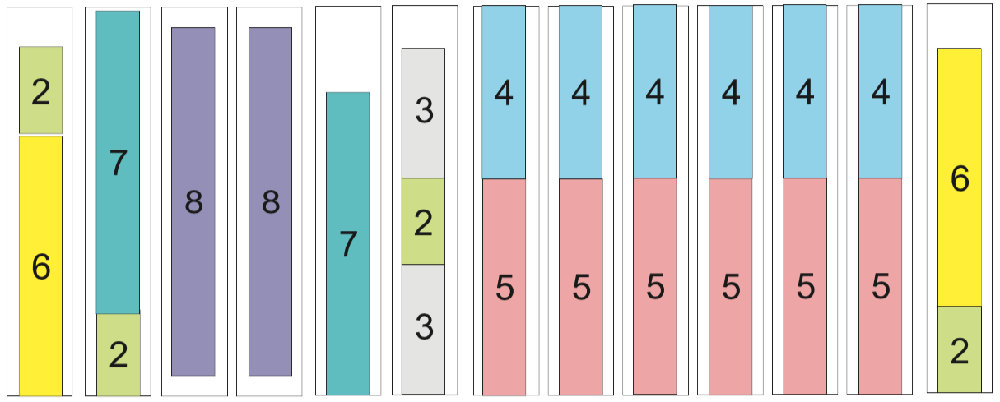
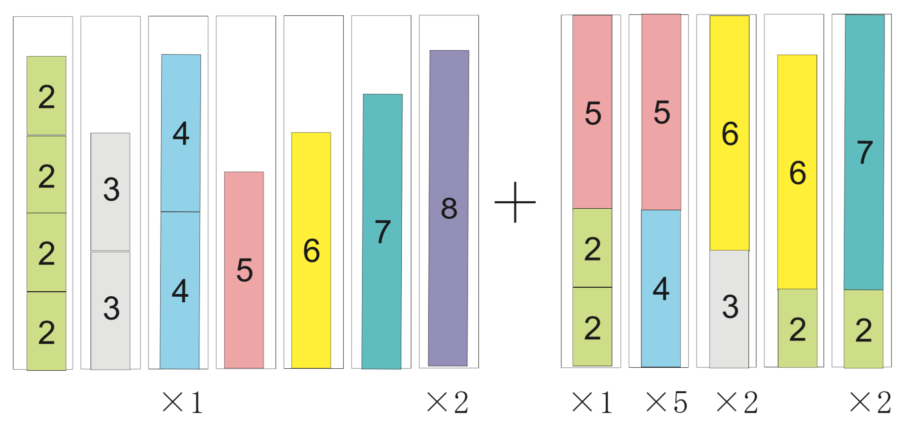

.. _bpp+csp:

Bin packing and cutting stock problems
********************************************************************************

.. todo::
   Adapt column generation to work with SCIP

.. index::
   single: bin packing problem
   single: cutting stock problem

This chapter deals with two classic problem: the bin packing problem and the cutting stock problem.  Let us start with some definitions and examples.

.. case study
.. container::

   You are the person in charge of packing in a large company.  Your job is to skillfully pack items of various weights in a box with a predetermined capacity; your aim is to use as few boxes as possible.  Each of the items has a known weights, and the upper limit of the contents that can be packed in a box is 9 kg.  The weight list of items to pack is given in Table :ref:`bpp-data`.  In addition, the items you are dealing with your company are heavy; there is no concern with the volume they occupy.  So, how should these items be packed?

   .. _bpp-data:

   .. table:: Weights of items to be packed in bins of size 9.

       +------------------------------------------------------------------------------+
       | Weights of items to be packed                                                |
       +==============================================================================+
       | 6, 6, 5, 5, 5, 4, 4, 4, 4, 2, 2, 2, 2, 3, 3, 7, 7, 5, 5, 8, 8, 4, 4, 5       |
       +------------------------------------------------------------------------------+

   .. _fig-bpp:

   .. figure:: FIGS/bpp-instance.png
      :scale: 25 %
      :align: center

      Bin packing instance

      Item weights and bin capacity for an instance of the bin packing problem.

      
This is an example of a problem called the *bin packing problem*.  It can be described mathematically as follows.

.. definition
.. pull-quote::
   Bin packing problem

   There are :math:`n` items to be packed and an infinite number of available bins of size :math:`B`.
   The sizes :math:`0 \leq s_i \leq B` of individual items are assumed to be known.
   The problem is to determine how to pack these :math:`n` items in bins of size :math:`B` so that the number of required bins is minimum.

A related problem is the *cutting stock problem*, which is defined as follows.

.. case study
.. container::

   You are the person in charge of cutting in a large company producing rolls of paper.  Your job is to skillfully cut the large rolls produced in a standard size into smaller rolls, with sizes demanded by the customers.  It is not always possible to fully use every roll; sometimes, it is necessary to create leftovers, called *trim loss*.  In this case, your aim is to use as few rolls as possible; in other words, to minimize the trim loss created.  The width of the large rolls is 9 meters, and there are customers' orders for seven different sizes, as detailed in Table :ref:`csp-data`.   So, how should the large rolls be cut?

   .. _csp-data:

   .. table:: Orders for different roll lengths.

       +---------------------------------+---------------------+
       | Length                          |Number of rolls      |
       +=================================+=====================+
       | 2 m                             | 4                   |
       +---------------------------------+---------------------+
       | 3 m                             | 2                   |
       +---------------------------------+---------------------+
       | 4 m                             | 6                   |
       +---------------------------------+---------------------+
       | 5 m                             | 6                   |
       +---------------------------------+---------------------+
       | 6 m                             | 2                   |
       +---------------------------------+---------------------+
       | 7 m                             | 2                   |
       +---------------------------------+---------------------+
       | 8 m                             | 2                   |
       +---------------------------------+---------------------+

   .. _fig-csp:

   .. figure:: FIGS/csp-instance.png
      :scale: 25 %
      :align: center

      Cutting stock instance

      Item lengths and roll size for an instance of the cutting stock problem.

The cutting stock problem can be described mathematically as follows.

.. definition
.. pull-quote::
   Cutting stock problem

   There are orders for :math:`i = 1, \ldots, m` different widths, with quantity :math:`q_i` ordered for width :math:`0 \leq w_i \leq B`, to be cut from standard rolls with width :math:`B`.
   The problem is to find a way to fulfill the orders while using the minimum number of rolls.

The bin packing and the cutting stock problems may at first glance appear to be different, but in fact it is the same problem.  This can be seen with the examples above, which actually refer to the same situation.  If find a the solution using a formulation for one of the problems, it will also be a solution for the other case.  As the problems are equivalent, deciding which to solve depends on the situation.

This chapter is structured as follows.
Section :ref:`bpp` presents a straightforward formulation for the bin packing problem.
Section :ref:`csp` describes the column generation method for the cutting stock problem.
For both cases, we show how to obtain a solution with SCIP/Python.

.. _bpp:
   
The Bin Packing Problem
=======================

.. In this section we consider the classical bin packing problems, which are well-known amongst the NP-hard combinatorial optimization problems. The problem instance can be simply stated as filling a number :math:`n` of items, each of which with a given size :math:`s_i`, into a given number of identical bins of certain capacity :math:`B`, such that the total number of bins used is minimum.
.. Formally, the optimization model can be described as follows. Let :math:`U` be the upper bound of the number of bins required; for example, the number of bins obtained with the first-fit decreasing heuristics. For the unknowns to be found, define variables :math:`x_{ij} = 1` if item :math:`i` is stored in :math:`j`-th bin and :math:`x_{ij} = 0` otherwise, for :math:`i=1, \ldots, n, j=1, \ldots, U`. Also, let :math:`y_j =1` if :math:`j`-th bin is used and :math:`y_j =0` otherwise. Then the integer-optimization model can be written as follows. 

   
In the bin packing problem, it is assumed that an upper bound :math:`U` of the number of bins is given.  In a simple formulation, a variable :math:`X` indicates whether an item is packed in a given bin, and a variable :math:`Y` specifies if a bin is used in the solution or not.

.. math::
  & X_{ij} = \left\{\begin{array}{ll}1 & \mbox{if item $i$ is packed in bin $j$} \\ 
                                     0  & \mbox{otherwise} \end{array} \right.\\
  & Y_j = \left\{\begin{array}{ll}   1  & \mbox{if bin $j$ is used} \\ 
                                     0  & \mbox{otherwise} \end{array} \right.\\

Using these variables, the bin packing problem can be described as an integer optimization problem.

.. math::
    & \mbox{minimize} \quad    & \sum_{j=1}^U Y_{j} &     \\
    & \mbox{subject to:} \quad & \sum_{j=1}^U X_{ij} = 1 &  \mbox{ for } i=1,\cdots,n\\
    &   & \sum_{i=1}^n s_i X_{ij} \leq B Y_{j}             &  \mbox{ for } j=1,\cdots,U\\
    &   & X_{ij} \leq Y_{j}                                &  \mbox{ for } i=1,\cdots,n; j=1,\cdots,U\\
    &   & X_{ij} \in \{ 0,1 \}                           & \mbox{ for }  i=1,\cdots,n; j=1,\cdots,U \\
    &   & Y_j \in \{ 0,1 \}                              & \mbox{ for }  j=1,\cdots,U

The objective function is the minimization of the number of bins used.  The first constraints force the placement of each item in one bin.  The second constraints represent the upper limit on the bins contents, as well as the fact that items cannot be packed in a bin that is not in use.  The third constraints provide an enhanced formulation, indicating that if a bottle is not used (:math:`Y_j = 0`), items cannot be placed there (:math:`X_{ij} = 0`).  Without these inequalities it is possible to find an optimum solution; however, as mentioned in Section :ref:`cflp-quality`, a speedup can be expected by the addition of these stronger constraints.

Let us see how this formulation can be written in SCIP/Python.  First of all, we will prepare a function to generate the example's data.

::

    def BinPackingExample():
        B = 9
        w = [2,3,4,5,6,7,8]
        q = [4,2,6,6,2,2,2]
        s=[]
        for j in range(len(w)):
            for i in range(q[j]):
                s.append(w[j])
        return s,B

Here, the data is prepared as for a cutting stock problem (width of rolls :math:`B`, number of orders :math:`q` and width orders :math:`w`) and is converted to the bin packing data (list :math:`s` of sizes of items, bin size :math:`B`).

.. index::
   single: heuristics
   single: FFD
   single: first fit decreasing

Next, we need to calculate the upper limit :math:`U` of the number of bins.  The bin packing problem has been for a long time a field for the development of heuristics.  *Heuristics* are procedures for obtaining a solution based on rules that do not guarantee that the optimum will be reached.  A well-known heuristics for this problem is *first-fit decreasing (FFD)*, which consists of arranging the items in non-increasing order of their size, and then for each item try inserting it in the first open bin where it fits; if no such bin exists, then open a new bin and insert the item there.  Here is a simple implementation in Python.

.. !!!!! for an efficient method, see Brandao & Pedroso, C&OR
.. !!!!! It has been proved that this heuristics uses no more than :math:`\frac{11}{9}L^* + 4` bins, where :math:`L^*` is the optimal number of bins .

::

    def FFD(s, B):
        remain = [B]
        sol = [[]]
        for item in sorted(s, reverse=True):
            for j,free in enumerate(remain):
                if free >= item:
                    remain[j] -= item
                    sol[j].append(item)
                    break
            else:
                sol.append([item])
                remain.append(B-item)
        return sol

In line 2, ``remain`` is a list to store the space remaining in bins currently in use, which is initialized to have only one bin of size :math:`B`.  The solution is stored in a list of lists, initialized in line 3 as a list containing an empty list; this represents a solution consisting of an empty bin.  Line 4 starts a ``for`` loop, where items are taken out in descending order of their size.  Here, ``sorted`` is a Python function for generating the contents of a list in order; with the optional parameter ``reverse=True``, the order is reversed.  Line 5 starts an iteration over the bins currenlty in use, where ``free`` is assigned to the space available in ``j`` th bin; if there is space available the current item is packed in ``j``.  If the current items doesn't fit in any bin, a new bin is created and the item is packed there.  Here, ``enumerate`` is a Python function returning tuples ``(index,value)`` with the index for each element (``value``) in a sequence.  The return value is list ``sol`` representing the solution found, and hence its length is an upper bound :math:`U` of the number of bins.

We now have the tools for implementing a function for solving the bin packing problem.

::

    def bpp(s,B):
        n = len(s)
        U = len(FFD(s,B))
        model = Model("bpp")
        x,y = {},{}
        for i in range(n):
            for j in range(U):
                x[i,j] = model.addVar(vtype="B", name="x(%s,%s)"%(i,j))
        for j in range(U):
            y[j] = model.addVar(vtype="B", name="y(%s)"%j)
        for i in range(n):
            model.addCons(quicksum(x[i,j] for j in range(U)) == 1, "Assign(%s)"%i)
        for j in range(U):
            model.addCons(quicksum(s[i]*x[i,j] for i in range(n)) <= B*y[j], "Capac(%s)"%j)
        for j in range(U):
            for i in range(n):
                model.addCons(x[i,j] <= y[j], "Strong(%s,%s)"%(i,j))
        model.setObjective(quicksum(y[j] for j in range(U)), "minimize")
        model.data = x,y
        return model
    
This model can be used to compute a list with the items that should be placed in each bin, as follows:

::

    def solveBinPacking(s,B):
        n = len(s)
        U = len(FFD(s,B))
        model = bpp(s,B)
        x,y = model.data
        model.optimize()
        bins = [[] for i in range(U)]
        for (i,j) in x:
            if model.getVal(x[i,j]) > .5:
                bins[j].append(s[i])
        for i in range(bins.count([])):
            bins.remove([])
        for b in bins:
            b.sort()
        bins.sort()
        return bins
    
Using the program above it is possible to obtain a solution with objective value (the number of bins) 13.
This solution is shown in Figure :ref:`fig-bpp-sol`.

.. _fig-bpp-sol:

   Solution
   
   Solution obtained for the bin packing example.

.. _csp:

Column generation method for the cutting stock problem
=======================================================

Here, we will introduce the column generation method for the cutting stock problem proposed by Gilmore-Gomory :cite:`Gilmore1961` :cite:`Gilmore1963`.

When representing a linear optimization problem by means of a matrix, the left-hand side of the constraints' coefficients, there is a correspondence of each row of the matrix to a constraint, and a correspondence between each column of the matrix and a variable.  Hence, constraints are often referred to as *rows*, and variables are also called *columns*.

.. index::
   single: column
   single: row
   single: column generation
   single: pattern

In the *column generation* method only a (usually small) subset of the variables is used initially.  The method sequentially addes columns (i.e., variables), using information given by the dual variables for finding the approriate variable to add.

Let us try to explain how it works by means of the example provided in :ref:`csp-data`.  There are many was of cutting the base roll into width requested in the order; let us consider a valid *cutting pattern* a set of widths whose sum does not exceed the roll's length (:math:`B = 9` meters).  First, we will generate simple patterns, each composed only of one ordered width repeated as many times as it fits in roll length.  For order :math:`j` of width :math:`w_j`, the number of times it can be cut from the base roll is :math:`B` divided by :math:`w_j` rounded down.  Let us represent a pattern as a vector (in the programs, as a list) with the number of times each width is cut.  For example, the width :math:`w_1 = 2` of order 1 was 2 meters, and will be cut :math:`\lfloor B/w_1 \rfloor = \lfloor 9/2 \rfloor = 4` times in case of cutting only the width of order 1; this cutting pattern can be represented as :math:`(4,0,0,0,0,0,0)`.  Repeating this for the other orders allows us to generate an initial set of cutting patterns.  A Python program for generating a list `t` of all the initial cutting patterns can be written as follows.

::

    t = []
    m = len(w)
    for i in range(m):
        pat = [0]*m
        pat[i] = int(B/w[i])
        t.append(pat)

The initial set of cutting patterns is the following (also represented on the left side of Figure :ref:`fig-csp-sol`).

::

   [4,0,0,0,0,0,0]
   [0,3,0,0,0,0,0]
   [0,0,2,0,0,0,0]
   [0,0,0,1,0,0,0]
   [0,0,0,0,1,0,0]
   [0,0,0,0,0,1,0]
   [0,0,0,0,0,0,1]

.. _fig-csp-sol:

   Solution
   
   Solution obtained for the cutting stock example.

If we define integer variable :math:`x_i` for representing the number of times to use cutting pattern :math:`i`, considering only the initial cutting patterns, an integer optimization problem problem for finding the minimum number of rolls to meet all the orders is the following.

.. math::
    & \mbox{ minimize }    & x_1 + & x_2 + & x_3 + & x_4 + & x_5 + & x_6 + & x_7 \\
    &                      & 4 x_1 & & & & & & &  \geq 4 \\
    &                      & & 3 x_2 & & & & & &  \geq 2 \\
    &                      & & & 2 x_3 & & & & &  \geq 6 \\
    &                      & & & & x_4 & & & &    \geq 6 \\
    &                      & & & & & x_5 & & &    \geq 2 \\
    &                      & & & & & & x_6 & &    \geq 2 \\
    &                      & & & & & & & x_7 &    \geq 2 \\
    &                      & x_1, & x_2, & x_3, & x_4, & x_5, & x_6, & x_7 & \; \geq \;  &  0, \mbox{integer}

If we now solve this linear optimization problem by relaxing the integer constraints, the optimum is :math:`16\frac{2}{3}` and an optimal solution is :math:`x = (1, 2/3, 3, 6, 2, 2, 2)`.  We can also obtain, for each constraint, the corresponding optimal dual variable: :math:`\lambda = (1/4, 1/3, 1/2, 1, 1, 1, 1)`.  These quantities can be interpreted as the *value* of each order in terms of the base roll; for example, :math:`\lambda_1 = 1/4` can be interpreted as "order 1 is worthy 1/4 of a roll".  (See margin seminar :ref:`duality` for an interpretation of the optimal values of dual variables.)

We can observe that in the first cutting pattern a lot of waste has been generated.  In order to obtain a more efficient cutting strategy, the base roll must be cut with different, high-value orders such that its width is not exceeded.

Using integer variables :math:`y_j` to represent how many pieces of order :math:`j` should be cut, finding the cutting pattern with the largest value can be formulated as the following integer optimization problem.

.. math::
    & \mbox{ minimize }    & \frac{1}{4} y_1 + & \frac{1}{3} y_2 + & \frac{1}{2} y_3 + & y_4 + & y_5 + & y_6 + & y_7 \\
    &                      & 2y_1            + &           3 y_2 + &          4 y_3  + & 5 y_4 + & 6 y_5 + & 7 y_6  + & 8 y_7 & \leq 9\\
    &                      & y_1, & y_2, & y_3, & y_4, & y_5, & y_6, & y_7 & \; \geq \;  &  0, \mbox{integer}

This is called the *integer knapsack problem*, a variant of the problem presented in Section :ref:`knapsack` where the variables are non-negative integers.  Even though the integer knapsack problem is known to be NP-hard, optimal solutions can be obtained relatively easily with SCIP.  For the instance above, the optimum is 1.5, and the corresponding solution is :math:`y = (2, 0, 0, 1, 0, 0, 0)`.  This indicates that a pattern with the value of 1.5 units of the base roll can be obtained by cutting a roll in two pieces of order 1 and one piece of order 4.

The reduced cost of this new column is :math:`1 − (2 \lambda_1 + \lambda_4) = −0.5`; this indicates that by adding a column with this cutting pattern it is possible to obtain a benefit of 0.5 base rolls.  (See Margin Seminar :ref:`reducedcosts` for the definition of reduced costs.)

We will now add this column and solve the linear relaxation problem again.  Let the variable :math:`x_8` indicate the number of times to use the new cutting pattern; the linear relaxation of the problem of finding a minimum number of rolls so as to satisfy the orders is as follows.

.. math::
    & \mbox{ minimize }    & \;\;\; x_1 & + x_2 & + x_3 & + x_4 & + x_5 & + x_6 & + x_7 & + x_8 \\
    &                      & 4 x_1 & & & & & & & + 2 x_8 & \geq 4 \\
    &                      & & 3 x_2 & & & & & &         & \geq 2 \\
    &                      & & & 2 x_3 & & & & &         & \geq 6 \\
    &                      & & & & x_4 & & & &    + x_8  & \geq 6 \\
    &                      & & & & & x_5 & & &           & \geq 2 \\
    &                      & & & & & & x_6 & &           & \geq 2 \\
    &                      & & & & & & & x_7 &           & \geq 2 \\
    &                      & x_1, & x_2, & x_3, & x_4, & x_5, & x_6, & x_7, & x_8 & \geq 0

In this example, after adding five new patterns the reduced cost of the new column found by solving the knapsack problem is not negative, and the column generation procedure stops.  As at the end we want an integer solution, we add the integrality constraints to the last linear optimization problem created in the procedure.  Solving this problem, we determine a solution using 13 rolls; the final set of patterns, as well as the count of each of them in the final solution, are shown in Figure :ref:`fig-csp-sol`.  Notice that, in general, there is no guarantee that all the relevant patterns had been added, and hence this solution may not be optimal for the original problem (though in this particular example we can show that the solution is optimal, as the minimum number of bins required is :math:`\lceil \sum_{i=1}^{m} q_i w_1 / B \rceil = \lceil 12\frac{2}{9} \rceil = 13`).

When the number of variable in a model is huge, the method of column generation is effective.
It is summarized below.

.. TIP::

   **Modeling tip 4**

   **Use the column generation method when the number of variables is extremely large.**

   For many practical problems (as the cutting stock problem above), a solution approach is to generate possible patterns and let an optimization model select the relevant patterns.

   The number of possible patterns may be enormous.  Rather than enumerating all the possibilities, it is effective to solve an appropriate subproblem (a knapsack problem, in the case of the cutting stock problem) to generate only relevant patterns.

   After defining the subproblem, the complicated part is the exchange of information between these two problems, in particular dual information.  However (as shown below), this is relatively simple to program with SCIP/Python.

Before describing the program used for solving the cutting stock problem, let us introduce a formulation and the column generation method in a general form.  Let the :math:`k`\ -th cutting pattern of base roll width :math:`B` into some of the :math:`m` width ordered be denoted as a vector :math:`(t^k_1, t^k_2, \ldots, t^k_m)`.  Here, :math:`t^k_i` represents the number of times the width of order :math:`i` is cut out in the :math:`k`\ -th cutting pattern.  For a pattern :math:`(t^k_1, t^k_2, \ldots, t^k_m)` (which is a packing in the bin packing problem) to be feasible, it must satisfy:

.. math::
   \sum_{k=1}^m t^k_i \leq B

Let us denote by :math:`K` the current number of cutting patterns.  The cutting stock problem is to decide how to cut a total number of ordered width :math:`j` at least :math:`q_j` times, from all the available cutting patterns, so that the total number of base rolls used is minimized.

.. math::
    & \mbox{ minimize }          & \sum_{k=1}^K x_{k} &     \\
    & \mbox{ subject to: } \quad & \sum_{k=1}^K t_i^k x_k \geq q_i  \quad & \mbox{ for } i=1,\ldots,m \\
    &                            & x_k \; \geq \;  0, \mbox{integer}\quad & \mbox{ for } k=1,\ldots,K.\\

.. index::
   single: master problem

This is called the *master problem*.  Consider the linear optimization relaxation of the master problem, and the optimal dual variable vector :math:`\lambda`.  Using :math:`\lambda` as the value assigned to each width :math:`i`, the next problem is to find a feasible pattern :math:`(y_1, y_2, \ldots, y_m)` that maximizes the value of the selected widths.  This is an integer knapsack problem; its solution will be used as an additional pattern in the master problem.

.. math::
    & \mbox{ maximize }          & \sum_{i=1}^m \lambda_i y_{i}  \\
    & \mbox{ subject to: } \quad & \sum_{i=1}^m w_i y_i \leq B  \\
    &                            & y_i \; \geq \;  0, \mbox{integer} \quad & \mbox{ for } i=1,\ldots,m. \\

Based on the notation introduced above, we will describe how to implement column generation for the cutting stock problem using SCIP/Python.  At first, we will create the model for the master problem, i.e., an integer optimization model for finding the minimum number of base rolls, with the currently available patterns, such that all the orders are satisfied.
Generated patterns are stored in the list ``t``, where ``t[k][[i]`` holds the number of times width ``i`` is used in pattern ``k``; that number multiplied by the number of times pattern ``k`` is used ``x[k]`` must satisfy the ordered number of width ``i``, ``q[i]``.  The objective is to minimize the number of base rolls needed, which is given by the sum of ``x[k]`` for all patterns ``k``.

::

    K = len(t)
    master = Model("master LP")
    x = {}
    for k in range(K):
        x[k] = master.addVar(vtype="I", name="x(%s)"%k)
    orders = {}
    for i in range(m):
        orders[i] = master.addCons(
            quicksum(t[k][i]*x[k] for k in range(K)) >= q[i])
    master.setObjective(quicksum(x[k] for k in range(K)), "minimize")

.. model not really working in SCIP... !!!!!

After generating an initial set of ``K`` patterns, the master problem is defined and an variable for each pattern is added to the model.  The main loop of the column generation method starts by solving the relaxation of the master problem, and assigning its dual variables to list ``lambda_``.  Then, the knapsack subproblem is defined.  The coefficients at the objective are the values of the dual variables, and the knapsack constraint is the width ``w[i]`` of ordered width ``i`` multiplied by the number of times that width is used in the pattern, ``y[i]``.  If the optimum for the subproblem less than 1, then the reduced costs have become all non-negative, and no more patterns are generated.  Otherwise, the new pattern is added to list ``t``, and a new column for this pattern is added to the master problem.

.. how to add a new column in SCIP?  !!!!!

::

        while True:
            relax = master.relax()
            relax.optimize()
            pi = [c.Pi for c in relax.getConstrs()]
            knapsack = Model("KP")
            knapsack.ModelSense=-1
            y = {}
            for i in range(m):
                y[i] = knapsack.addVar(ub=q[i], vtype="I", name="y[%d]"%i)
            knapsack.update()
            knapsack.addConstr(quicksum(w[i]*y[i] for i in range(m)) <= B, "width")
            knapsack.setObjective(quicksum(pi[i]*y[i] for i in range(m)), GRB.MAXIMIZE)
            knapsack.optimize()
            if knapsack.ObjVal < 1+EPS:
                break
            pat = [int(y[i].X+0.5) for i in y]
            t.append(pat)
            col = Column()
            for i in range(m):
                if t[K][i] > 0:
                    col.addTerms(t[K][i], orders[i])
            x[K] = master.addVar(obj=1, vtype="I", name="x[%d]"%K, column=col)
            master.update()
            K += 1

        master.optimize()
        rolls = []
        for k in x:
            for j in range(int(x[k].X + .5)):
                rolls.append(sorted([w[i] for i in range(m) if t[k][i]>0 for j in range(t[k][i])]))
        rolls.sort()
        return rolls

.. model not really working in SCIP... !!!!!
        
After finishing the column generation cycle, the (integer) model with all added patterns is solved.
