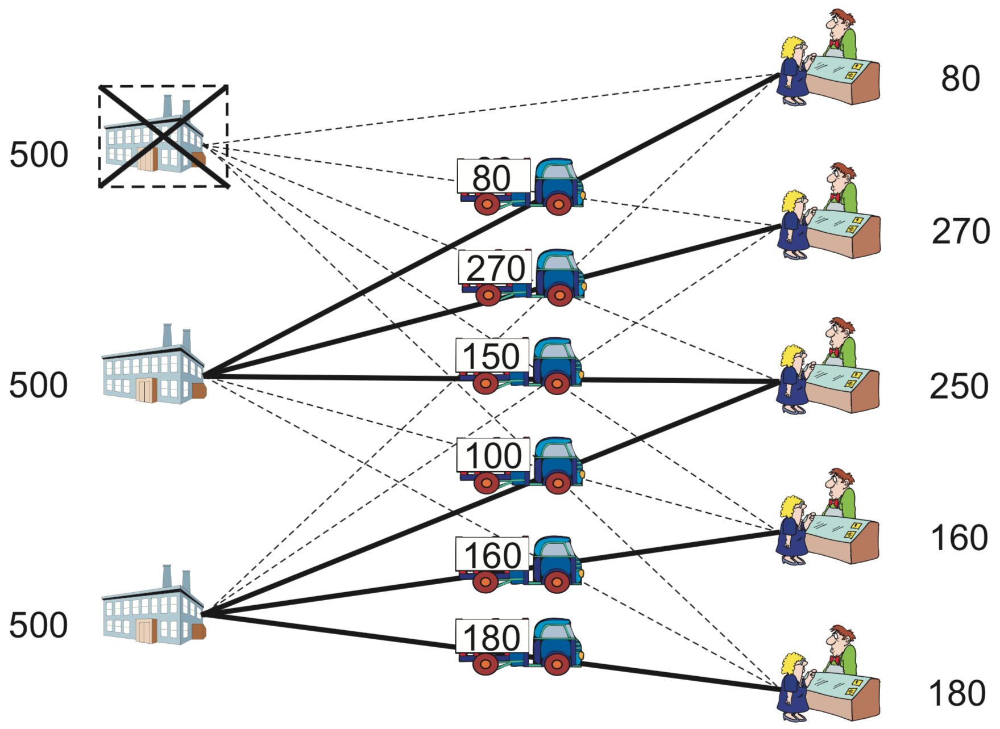
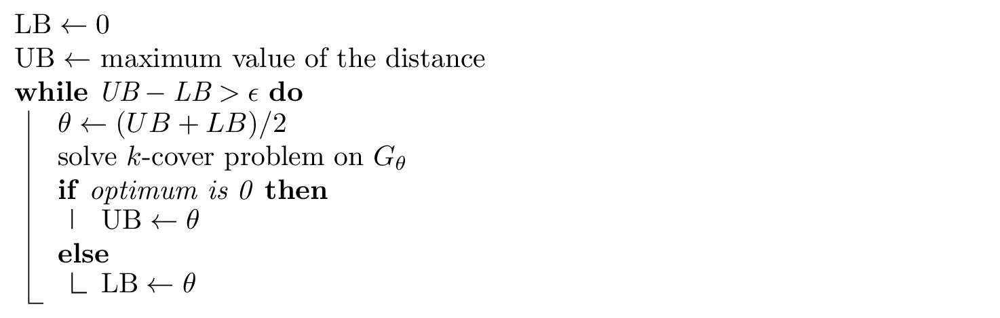
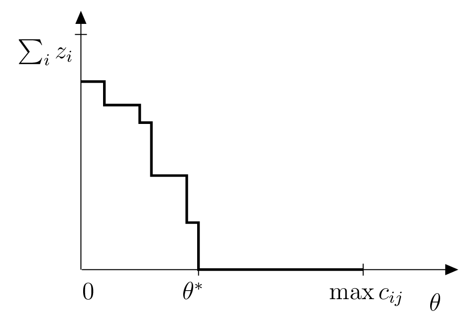

.. _flp:

********************************************************************************
Facility location problems
********************************************************************************

.. todo::
   Adapt figures, check maths
   Computational experiment comparing formulations
   Adapt kmedian --- seems to be still gurobi version

*To import SCIP in python, do:*

.. code-block:: python

   from pyscipopt import Model, quicksum, multidict

.. index::
   single: facility location

We will deal here with facility location, which is a classical optimization problem for determining the sites for factories and warehouses.   A typical *facility location problem* consists of choosing the best among potential sites, subject to constraints requiring that demands at several points must be serviced by the established facilities. The objective of the problem is to select facility sites in order to minimize costs; these typically include a part which is proportional to the sum of the distances from the demand points to the servicing facilities, in addition to costs of opening them at the chosen sites. The facilities may or may not have limited capacities for servicing, which classifies the problems into capacited and uncapacited variants.  We will analyze several formulations; it is not straightforward to determine which are good and which are bad, but we will provide some tips for helping on this.

The structure of this chapter is the following.
In Section :ref:`cflp`, we consider the capacity constrained facility location problem, which will be used to explain the main points of a program in SCIP/Python for solving it.
In Section :ref:`cflp-quality`, we discuss the quality of different formulations.
In Section :ref:`kmedian`, we will present a type of facility location problem that minimizes the sum of the distance to the nearest facility, where the number of facilities is fixed to :math:`k`: the :math:`k`-median problem
In Section :ref:`kcenter`, we consider a type of facility location problems where the *maximum* value of the distance from a customer to one of the :math:`k` open facilities is to be minimized.  Thus, in this problem we want to find the minimum of maximum value.  This is often a tough problem, hard to tackle with a mathematical optimization solver; we will describe some workarounds.

.. _cflp:

Capacitated facility location problem
=====================================

.. index::
   single: capacitated facility location
   single: activation cost
   
The *capacitated facility location problem* is the basis for many practical optimization problems, where the total demand that each facility may satisfy is limited. Hence, modeling such problem must take into account both demand satisfaction and capacity constraints.

Let us start with a concrete example.  Consider a company with three potential sites for installing its facilities/warehouses and five demand points, as in Section :ref:`transp`.  Each site :math:`j` has a yearly *activation cost* :math:`f_j`, i.e., an annual leasing expense that is incurred for using it, independently of the volume it services.  This volume is limited to a given maximum amount that may be handled yearly, :math:`M_j`.  Additionally, there is a transportation cost :math:`c_{ij}` per unit serviced from facility :math:`j` to the demand point :math:`i`.  These data are shown in Table :ref:`cflp-data`.

.. _cflp-data:

.. table:: Data for the facility location problem: demand, transportation costs, fixed costs, and capacities.

    +---------------------------+-----+-----+-----+-----+-----+-------------+-------------+
    |        Customer :math:`i` |   1 |   2 |   3 |   4 |   5 |             |             |
    +---------------------------+-----+-----+-----+-----+-----+-------------+-------------+
    | Annual demand :math:`d_i` |  80 | 270 | 250 | 160 | 180 |             |             |
    +---------------------------+-----+-----+-----+-----+-----+-------------+-------------+
    |        Facility :math:`j` |     :math:`c_{ij}`          | :math:`f_j` | :math:`M_j` |
    +===========================+=====+=====+=====+=====+=====+=============+=============+
    |                         1 |   4 |   5 |   6 |   8 |  10 |        1000 |         500 |
    +---------------------------+-----+-----+-----+-----+-----+-------------+-------------+
    |                         2 |   6 |   4 |   3 |   5 |   8 |        1000 |         500 |
    +---------------------------+-----+-----+-----+-----+-----+-------------+-------------+
    |                         3 |   9 |   7 |   4 |   3 |   4 |        1000 |         500 |
    +---------------------------+-----+-----+-----+-----+-----+-------------+-------------+

This situation and its solution are represented in Figure :ref:`fig-loc`.

.. _fig-loc:

   Facility location

   Left: graph representation of an instance of the facility location problem.  Suppliers are represented as squares and clients as circles.   Right: possible solution, with thick lines representing selected facilities and arcs actually used for transportation.

Let us formulate the above problem as a mathematical optimization model.  Consider :math:`n` customers :math:`i = 1, 2, \ldots, n` and :math:`m` sites for facilities :math:`j = 1, 2, \ldots, m`.  Define continuous variables :math:`x_{ij} \geq 0` as the amount serviced from facility :math:`j` to demand point :math:`i`, and binary variables :math:`y_j = 1` if a facility is established at location :math:`j`, :math:`y_j = 0` otherwise.  An integer-optimization model for the capacitated facility location problem can now be specified as follows:

.. math::
    & \text{minimize} \quad    & \sum_{j=1}^m f_j y_j +\sum_{i=1}^n \sum_{j=1}^m c_{ij} x_{ij} &     \\
    & \text{subject to:} \quad & \sum_{j=1}^m x_{ij} =d_i  &  \mbox{ for }  i=1,\cdots,n \\
    &    & \sum_{i=1}^n x_{ij} \leq M_j y_j & \mbox{ for } j=1,\cdots,m  \\
    &    & x_{ij} \leq d_i y_j              & \mbox{ for } i=1,\cdots,n; j=1,\cdots,m \\
    &    & x_{ij} \geq 0                    & \mbox{ for } i=1,\cdots,n; j=1,\cdots,m \\
    &    & y_j \in \{ 0,1 \}                & \mbox{ for } j=1,\cdots,m 

The objective of the problem is to minimize the sum of facility activation costs and transportation costs.
The first constraints require that each customer's demand must be satisfied. The capacity of each facility :math:`j` is limited by the second constraints: if facility :math:`j` is activated, its capacity restriction is observed; if it is not activated, the demand satisfied by :math:`j` is zero. Third constraints provide variable upper bounds; even though they are redundant, they yield a much tighter linear programming relaxation than the equivalent, weaker formulation without them, as will be discussed in the next section.

The translation of this model to SCIP/Python is straightforward; it is done in the program that follows.

.. literalinclude:: ../STRIPPED/flp.py
   :pyobject: flp
   :linenos:

Data for this problem may be specified in Python as follows:

.. code-block:: python
   :linenos:

    I, d = multidict({1:80, 2:270, 3:250, 4:160, 5:180})
    J, M, f = multidict({1:[500,1000], 2:[500,1000], 3:[500,1000]})
    c = {(1,1):4,  (1,2):6,  (1,3):9,
         (2,1):5,  (2,2):4,  (2,3):7,
         (3,1):6,  (3,2):3,  (3,3):4,
         (4,1):8,  (4,2):5,  (4,3):3,
         (5,1):10, (5,2):8,  (5,3):4,
         }

We can now solve the problem:

.. code-block:: python
   :linenos:

    model = flp(I, J, d, M, f, c)
    model.optimize()
    EPS = 1.e-6
    x,y = model.__data
    edges = [(i,j) for (i,j) in x if model.GetVal(x[i,j]) > EPS]
    facilities = [j for j in y if model.GetVal(y[j]) > EPS]
    print "Optimal value=", model.GetObjVal()
    print "Facilities at nodes:", facilities
    print "Edges:", edges

The optimal solution obtained suggests establishing the facilities at Sites 2 and 3 only, as shown in Table :ref:`cflp-sol`. This solution incurs minimum total cost of 5610 for servicing all the demands.

.. _cflp-sol:

.. table:: Optimum solution for the facility location problem example.
           
    +---------------------------+-----+-----+-----+-----+-----+-------------+
    |        Customer           |   1 |   2 |   3 |   4 |   5 |             |
    +---------------------------+-----+-----+-----+-----+-----+-------------+
    |        Facility           |   Volume transported        | Status      |
    +===========================+=====+=====+=====+=====+=====+=============+
    |                         1 |   0 |   0 |   0 |   0 |   0 | closed      |
    +---------------------------+-----+-----+-----+-----+-----+-------------+
    |                         2 |  80 | 270 | 150 |   0 |   0 | open        |
    +---------------------------+-----+-----+-----+-----+-----+-------------+
    |                         3 |   0 |   0 | 100 | 160 | 180 | open        |
    +---------------------------+-----+-----+-----+-----+-----+-------------+

.. code-block:: none
   :linenos:

    Optimal value= 5610.0
    Facilities at nodes: [2, 3]
    Edges: [(1, 2), (3, 2), (3, 3), (4, 3), (2, 2), (5, 3)]

[`source code <SCIP/flp.py>`_]

.. _cflp-quality:

Weak and strong formulations
============================

.. index::
   single: uncapacitated facility location
   single: big M

.. case study
.. container::

   Let us consider the facility location problem of the previous section, in a situation where the capacity constraint is not important (any quantity may can be produced at each site).  This is referred to as the *uncapacitated facility location problem*.  One way of modeling this situation is to set the value of :math:`M` in the constraint

   .. math::
      \sum_{i=1}^n x_{ij} \leq M_j y_j & \mbox{ for } j=1,\cdots,m

   as a very large number.  Notice that the formulation is correct even if we omit constraints :math:`x_{ij} \leq d_j y_j, \mbox{ for }  i=1,\cdots,n; j=1,\cdots,m`.  Removing that constraint, the problem may suddenly become very difficult to solve, especially as its size increases; the reason is the *big :math:`M` pitfall*.

Parameter :math:`M` represents a *large enough* number, usually called **Big M**; it is associated with one of the biggest pitfalls for beginners in mathematical optimization.  The idea behind the constraint is to model the fact that "if we do not activate a warehouse, we cannot transport from there".  However, large values for :math:`M` do disturb the model in practice.  Constraints with a "Big M" may be a burden to the mathematical optimization solver, making the model extremely difficult to solve.

.. TIP::

   **Modeling tip 2**

   A large number :math:`M` must be set to a value *as small as possible*

   Whenever possible, it is better not to use a large number.  If its use is necessary, choose a number that is as small as possible, as long as the formulation is correct.   Using large numbers, as :math:`M=9999999`, is unthinkable, except for very small instances.

In the uncapacitated facility location problem, a correct formulation is to set the capacity :math:`M` equal to the total amount demanded.  However, it is possible to improve the formulation by adding the contraints :math:`x_{ij} \leq d_i y_j`.  The natural question here is "what formulation should we use"?  Of course, the answer depends on the particular case; but in general *stronger formulations* are recommended.  Here, the *strength* of a formulation is not ambiguous: it can be defined in terms of the linear optimization relaxation as follows.

.. index::
   single: linear optimization relaxation
   single: strong formulation
   single: weak formulation

.. definition
.. pull-quote::
   Definition: Strong and Weak Formulations

   Suppose that there are two formulations :math:`A` and :math:`B` for the same problem.  By excluding the integrality constraints (which force variables to take an integer value), we obtain the *linear optimization relaxation*.  Let the feasible region of formulations be :math:`P_A` and :math:`P_B`.  When the region :math:`P_B` contains :math:`P_A`, i.e., :math:`P_A \subset P_B`, formulation :math:`A` is *stronger* than formulation :math:`B` (analogously, :math:`B` is *weaker* than :math:`A`).

Intuitively, as :math:`P_A` is tighter than :math:`P_B`, the upper bound obtained by the relaxation in a maximization problem (or the lower bound in minimization) is closer to the optimum of the integer problem.

.. case study
.. container::
   For example, concerning the facility location problem of the previous section, a formulation using the constraints 

   .. math::
      x_{ij} \leq d_i y_j

   is stronger than using only constraints

   .. math::
      \sum_{j=1}^m x_{ij} \leq \left( \sum_{i=1}^n d_{i} \right) y_j.

To verify it, let :math:`P_A` be the feasible region using the former constraints and :math:`P_B` the feasible region when using the latter; observe that the latter constraints are obtained by adding the former, hence :math:`P_A \subseteq P_B`

A truly stronger formulation is either indicated by having :math:`P_A \subset P_B`, or by verifying that solution of the linear optimization relaxation of :math:`B` is not included in :math:`P_A`.

As for the question "is it always preferable to use a stronger formulation?", there is not a theoretical answer; distinguishing each case is part of the mathematical modeling art.

Let us try to give some guidance on this.  Often, stronger formulations require many more constraints or variables than weaker formulations.  In the previous example, the strong formulation requires :math:`n m` constraints, while the weak requires only :math:`n`.  The time for solving the linear relaxation, which depends on the number of constraints and variables, is likely to be longer in the case of the stronger formulation.  Hence, there is a trade-off between shorter times for solving linear optimization relaxations in weaker formulations, and longer computational times for branch-and-bound; indeed, the enumerating tree is likely smaller for stronger formulations.  As a guideline, as the size of the enumeration tree grows very rapidly when the scale of the problem increases, stronger formulations are considered more desirable (even if the number of constraints and variables becomes larger).

.. _kmedian:

The :math:`k`-Median Problem
============================

.. index::
   single: :math:`k`-median problem
   single: uncapacitated facility location

There are many variants of the facility location problem; here we will consider the following classic problem.

.. definition
.. pull-quote::
   **Median problem**

   Select a given number of facilities from possible points in a graph, in such a way that the **sum** of the distances from each customer to the closest facility is minimized.

Often, the number of facilities to be selected is predetermined in advance; this number is commonly denoted :math:`k` (or :math:`p`), and the corresponding problem is given this symbol as a suffix.

The :math:`k`\ *-median problem* is hence a variant of the *uncapacitated facility location problem* and specifically seeks to establish :math:`k` facilities, without considering fixed costs.

.. Moreover, each demand point is serviced by exactly one facility. The objective is to service all demand points at minimum total cost.

The distance from the customer :math:`i` to facility :math:`j` is denoted :math:`c_{ij}`, the set of customers by :math:`\{1,n\}`, and the set of potential places for facilities by :math:`\{1,m\}`. In the most common situation, it is assumed that facilities and customers share the same set of points.  Let us define the following variables:

.. math::
  & x_{ij} = \left\{\begin{array}{ll}1 & \mbox{when the demand of customer $i$ is met by facility $j$} \\ 
                                     0  & \mbox{otherwise} \end{array} \right.\\
  & y_j = \left\{\begin{array}{ll}   1  & \mbox{when facility $j$ is open} \\ 
                                     0  & \mbox{otherwise} \end{array} \right.\\

Using the symbols and variables defined above, the :math:`k`-median problem can be formulated as an integer-optimization model.

.. math::
    & \mbox{minimize} \quad    & \sum_{i=1}^n \sum_{j=1}^m c_{ij} x_{ij} &     \\
    & \mbox{subject to:} \quad & \sum_{j=1}^m x_{ij} =1 &  \mbox{ for } i=1,\cdots,n\\
    &   & \sum_{j=1}^m y_{j} = k                        &   \\
    &   & x_{ij} \leq y_j                               & \mbox{ for }  i=1,\cdots,n; j=1,\cdots,m  \\
    &   & x_{ij} \in \{ 0,1 \}                          & \mbox{ for }  i=1,\cdots,n; j=1,\cdots,m \\
    &   & y_j \in \{ 0,1 \}                             & \mbox{ for }  j=1,\cdots,m

.. case study
.. container::
   The first constraints require that each customer :math:`i` is assigned to exactly one facility :math:`j`.  The second constraint ensure that exactly :math:`k` facilities are established.  The third constraints force the facility :math:`j` to be open if the demand point :math:`i` is serviced from it.  Notice that a weaker formulation is obtained if we replace these :math:`n m` constraints by :math:`n` constraints 

   .. math::
      &   & \sum_{i=1}^{n} x_{ij} \leq y_j,                               & \mbox{ for }  j=1,\cdots,m.  \\

   However, as explained in the previous section, this constraints will lead to much worse values in the linear relaxation, and should be avoided.

The objective function minimizes the total cost of servicing all demand points.

As an illustration of this problem, consider the solution obtained for a graph with 200 vertices placed randomly in the two-dimensional unit box, represented in Figure :ref:`figkmedian`. Costs are given by the Euclidean distance between the points, and each of the vertices is a potential location for a facility.

.. _figkmedian:

.. figure:: FIGS/median.pdf
   :scale: 50 %
   :align: center

   :math:`k`-median 

   Solution of the :math:`k`-median model to a instance with 200 random vertices on the plane, and :math:`k=20`.

The following Python program shows how to create a model for this problem, implemented as a function that takes the problem's data as parameters, and returns variable objects ``x`` and ``y`` as attribute data of the model object.

.. literalinclude:: ../STRIPPED/kmedian.py
   :pyobject: kmedian
   :linenos:

.. _kcenter:

The :math:`k`-Center Problem
=============================

.. index::
   single: :math:`k`-center problem
   single: uncapacitated facility location

The :math:`k`-median problem, considered above, has an interesting variant called the :math:`k`\ *-center problem*.

.. definition
.. pull-quote::
   **Center problem**

   Select a given number of facilities from possible points in a graph, in such a way that the **maximum value** of a distance from a customer to the closest facility is minimized.

.. _figkcenter:

.. figure:: FIGS/center.pdf
   :scale: 75 %
   :align: center

   :math:`k`-center

   Solution of :math:`k`-center to a random instance with 100 nodes and :math:`k=10`.

Essentially, the problem seeks an assignment of facilities to a subset of vertices in the graph so that each customer's vertex is “close” to some facility.  As in the :math:`k`-median problem, the number of facilities to be selected is predetermined in advance, and fixed to a value :math:`k`.  Input data for the :math:`k`-center problem is also the distance :math:`c_{ij}` from the customer :math:`i` to facility :math:`j`, the set of customers by :math:`\{1,n\}`, and the set of potential places for facilities by :math:`\{1,m\}`; often, again, it is assumed that facilities and customers share the same set of points.  Variables have the same meaning:

.. math::
  & x_{ij} = \left\{\begin{array}{ll}1 & \mbox{when the demand of customer $i$ is met by facility $j$} \\ 
                                     0  & \mbox{otherwise} \end{array} \right.\\
  & y_j = \left\{\begin{array}{ll}   1  & \mbox{when facility $j$ is open} \\ 
                                     0  & \mbox{otherwise} \end{array} \right.\\

In addition, we introduce a continuous variable :math:`z` to represent the distance/cost for the customer which is most distant from an established facility.  Using these symbols and variables, the :math:`k`-center problem can be formulated as the following mixed-integer optimization problem.

.. math::
    & \mbox{minimize} \quad    & z &     \\
    & \mbox{subject to:} \quad & \sum_{j=1}^m x_{ij} = 1  & \mbox{ for }  i=1,\cdots,n \\
    &   & \sum_{j=1}^m y_{j} = k                          & \\
    &   &  x_{ij} \leq y_j                                & \mbox{ for }  i=1,\cdots,n; j=1,\cdots,m \\
    &   & \sum_{j=1}^m c_{ij} x_{ij} \leq z               & \mbox{ for }  i=1,\cdots,n\\
    &   & x_{ij} \in \{ 0,1 \}                            & \mbox{ for }  i=1,\cdots,n; j=1,\cdots,m \\
    &   & y_j \in \{ 0,1 \}                               & \mbox{ for }  j=1,\cdots,m

..  WEAK VERSION would be &   & c_{ij} x_{ij} \leq z                            & \mbox{ for }  i=1,\cdots,n; j=1,\cdots,m\\
 
The first constraints require that each customer :math:`i` is assigned to exactly one facility.  The second  constraints ensure that exactly :math:`k` facilities are opened. The third constraints force facility :math:`j` to be activated some customer :math:`i` is assigned to :math:`j`. The fourth constraints determine :math:`z` to take on at least the value weight :math:`c_{ij}`, for all facilities :math:`j` and customers :math:`i` assigned to :math:`j`.  A version of these constraints which may be more natural, but which is much weaker, is to specify instead :math:`c_{ij} x_{ij} \leq z, \mbox{ for }  i=1,\cdots,n; j=1,\cdots,m`.  Intuitively, we can reason that in the strong formulation, as we are adding more terms in the left-hand side, the corresponding feasible region is tighter.
The objective function represents the distance that the customer which is served by the most distant facility, as calculated by the third constraints, must travel.

.. index::
   single: min-max objective

The objective of the :math:`k`-center problem is a classic case of minimizing a maximum value, also called a *min-max* objective; this is a type of problems for which mathematical optimization solvers are typically weak.　　

The following Python program shows how to create a model for the :math:`k`-center problem; it is very similar to the program used to solve the :math:`k`-median problem.

.. literalinclude:: ../STRIPPED/kcenter.py
   :pyobject: kcenter
   :linenos:

   
.. !!!!! As an illustration of this, please refer to Figure [fig:kcenter]; for solving this instance with 100 vertices and :math:`k=10` SCIP used far more CPU time than for solving the instance shown in Figure :ref:`figkmedian`, having 200 vertices and :math:`k=20`, with the :math:`k`-median formulation. This is also evident in Figure :ref:`k-center-binsearch`. Fortunately, in this case, we can derive another method for solving the :math:`k`-center problem that does not use min-max objective.

.. NOTE::

   **Margin seminar 4**

   *Techniques in linear optimization*

   As illustrated in the text, the problem of "minimization of the maximum value" can be reduced to a standard linear optimization, by adding a new variable and a few modifications to the model.  Here, we will describe with more detail these techniques in linear optimization.  Let us give a simple example.  Assume that we want to minimize the maximum of two linear expressions, :math:`3x_1 + 4x_2` and :math:`2x_1 + 7x_2`.  For this, we introduce a new variable :math:`z` and the constraints:

   .. math::
      & 3x_1 + 4x_2 \leq z\\
      & 2x_1 + 7x_2 \leq z\\

   With the addition of these linear constraints, minimizing :math:`z` will correctly model the minimization of the maximum of those two expressions.

   A related topic that often arises in practice is the minimization of the absolute value :math:`| x |` of a real variable :math:`x` , which is a nonlinear expression.  We can linearize it by means of two non-negative variables :math:`y` and :math:`z`.  Firstly, we compute the value of :math:`x` in terms of :math:`y` and :math:`z`, though the constraint :math:`x = y - z`.  Now, since :math:`y \geq 0` and  :math:`z \geq 0`, we can represent a positive :math:`x` with :math:`z=0` and :math:`y>0`, and a negative :math:`x` with :math:`y=0` and :math:`z>0`.  Then, :math:`|x|` can be written as :math:`x+y`.  In other words, all occurrences of :math:`x` in the formulation are replaced by :math:`y-z`, and :math:`|x|` in the objective function is replaced by :math:`y+z`.

   It is also possible to handle an absolute value by simply adding one variable :math:`z` and then imposing :math:`z \geq x` and :math:`z \geq -x`.  When minimizing :math:`z`, if :math:`x` is non-negative, then the contraint :math:`z \geq x` is active; otherwise, :math:`z \geq -x` is binding.  Variable :math:`z` replaces :math:`|x|` in the objective function.

.. index::
   single: incumbent solution
   single: duality gap

.. TIP::

   **Modeling tip 3**

   *An objective function that minimizes a maximum value should be avoided, if possible.*

   When an integer optimization problem is being solved by the branch-and-bound method, if the objective function minimizes the maximum value of a set of variables (or maximizes their minimum value), there is a tendency to have large values for the difference between the lower bound and the upper bound (the so-called *duality gap*).
   In this situation, either the time for solving the problem becomes very large, or, if branch-and-bound is interrupted, the solution obtained (the *incumbent* solution) is rather poor.
   Therefore, when modeling real problems, it is preferable to avoid such formulations, if possible.
   
   
.. _kcover:

The :math:`k`-Cover Problem
----------------------------

.. index::
   single: :math:`k`-cover problem
   single: cover

   
The :math:`k`-center problem, considered above, has an interesting variant which allows us to avoid the min-max objective, based on the so-called the :math:`k`\ *-cover problem*.  In the following, we utilize the structure of :math:`k`-center in a process for solving it making use of binary search.

Consider the graph :math:`G_{\theta}=(V,E_{\theta})` consisting of the set of edges whose distances from a customer to a facility which do not exceed a threshold value :math:`\theta`, i.e., edges :math:`E_{\theta} = \{\{i,j\} \in E : c_{ij} \leq \theta\}`. Given a subset :math:`S \subseteq V` of the vertex set, :math:`S` is called a *cover* if every vertex :math:`i \in V` is adjacent to at least one of the vertices in :math:`S`. We will use the fact that the optimum value of the :math:`k`-center problem is less than or equal to :math:`\theta` if there exists a cover with cardinality :math:`|S|=k` on graph :math:`G_{\theta}`.

Define :math:`y_j = 1` if a facility is opened at :math:`j` (meaning that the vertex :math:`j` is in the subset :math:`S`), and :math:`y_j = 0` otherwise. Furthermore, we introduce another variable:

.. math::
  & z_{i} = \left\{\begin{array}{ll} 1 & \mbox{vertex $i$ is adjacent to no vertex in $S$ (it is not covered),} \\ 
                                       0 & \mbox{otherwise.} \end{array} \right.\\

Let us denote by :math:`[a_{ij}]` the incidence matrix of :math:`G_{\theta}`, whose element :math:`a_{ij}` is equal to :math:`1` if vertices :math:`i` and :math:`j` are adjacent, and is equal to :math:`0` otherwise. Now we need to determine whether the graph :math:`G_{\theta}` has a cover :math:`|S|=k`; we can do that by solving the following integer-optimization model, called the :math:`k`-cover problem on :math:`G_{\theta}`:

.. math::
    \mbox{ minimize } & \sum_{i=1}^n  z_{i} &     \\
    \mbox{ subject to   } &
    \sum_{j=1}^m a_{ij} y_{j} + z_{i} \geq 1 &  \mbox{ for }  i=1,\cdots,n \\
       & \sum_{j=1}^m y_{j} = k &   \\
                    & z_{i} \in \{ 0,1 \}    & \mbox{ for } i=1,\cdots,n \\
                    & y_j \in \{ 0,1 \} & \mbox{ for }  j=1,\cdots,m.

Notice that the adjacency matrix is built upon a given value of distance :math:`\theta`, based on which is computed the set of facilities that may service each of the customers within that distance. For a given value of :math:`\theta` there are two possibilities: either the optimal objective value of the previous optimization problem is zero (meaning that :math:`k` facilities were indeed enough for covering all the customers withing distance :math:`\theta`), of it may be greater that zero (meaning that there is at least one :math:`z_i>0`, and thus a customer could not be serviced from any of the :math:`k` open facilities). In the former case, we attempt to reduce :math:`\theta`, and check if all customers remain covered; in the latter, :math:`\theta` is increased.  This process is repeated until the bounds for :math:`\theta` are close enough, in a process called *binary search*.

.. index::
   single: binary search

.. _binsearchalg:

   Binary search method for solving the :math:`k`-center problem.

An illustration is provided in Figure :ref:`binsearchfig`.

.. _binsearchfig:

   Search for optimum :math:`\theta` with binary search.

Using these ideas, we can get the optimal value of the :math:`k`-center problem by the following binary search method.

.. literalinclude:: ../STRIPPED/kcenter_binary_search.py
   :pyobject: kcover
   :linenos:

.. literalinclude:: ../STRIPPED/kcenter_binary_search.py
   :pyobject: solve_kcenter
   :linenos:

..
   # usage: !!!!!
   facilities, edges = solve_kcenter(I, J, c, k, delta)

In Table :ref:`k-runtimes` we provide some numbers, for having just an idea of the order of magnitude of the computational times involved in these problems.  They concern an instance with 200 vertices randomly distributed in the plane and :math:`k=5`. 

.. _k-runtimes:

.. table:: Solution and runtimes for a random instance.

    +---------------------------------+--------------+--------------+
    |                                 | max distance | CPU time (s) |
    +=================================+==============+==============+
    | :math:`k`-median                |       0.3854 |          3.5 |
    +---------------------------------+--------------+--------------+
    | :math:`k`-center                |       0.3062 |        645.5 |
    +---------------------------------+--------------+--------------+
    | :math:`k`-cover + binary search |       0.3062 |          2.5 |
    +---------------------------------+--------------+--------------+

As we can see, :math:`k`-cover within binary search method allows the computation of the :math:`k`-center solution in a time comparable to that required for the :math:`k`-median solution.

From a practical point of view, the :math:`k`-center solution is usually preferable to that of :math:`k`-median. Indeed, the longest time required for servicing a customer is frequently an important criterion to be considered by a company, and this may be prohibitively large on the :math:`k`-median solution.

.. !!!!! , as illustrated in Figure [fig:k-center-binsearch].

..
   figure:: FIGS/k-center-binsearch.png
   :align: center

.. !!!!! In random graphs this is often not much noticeable, but in Figure [fig:kcenter-kmedian-comparison] one may see that the arc connecting node 60 is rather large in the :math:`k`-median solution; the :math:`k`-center model lead to a facility being located in that vertex.

..
   figure:: FIGS/kcenter-kmedian-comparison..png
   :align: center

..
   figure:: FIGS/k_center_binsearch_cpu.png
   :align: center

