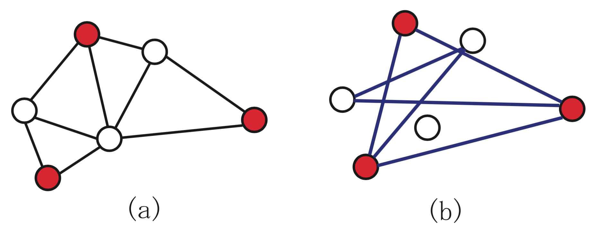

.. _graph:

Graph problems
********************************************************************************

.. todo::
   Adapt everything: figures, maths, ...

.. index::
   single: graph problems

In this chapter we will present models for three optimization problems with a combinatorial structure  (graph partitioning problem, maximum stable set problem, graph coloring problem) and try to solve them with SCIP/Python.  All the models dealt with here are based on the definition of a graph.  A graph is an abstract concept, a construction derived from vertices and edges linking two vertices, but many of the practical optimization problem can be defined naturally by means of graphs.

The roadmap for this chapter is the following.  Section :ref:`gpp` deals with the basic notions of graph theory and with the graph partitioning problem, describing a method for dealing with a quadratic objective function by linearizing it.  Section :ref:`ssp` presents the maximum stable set problem.  Section :ref:`gcp` describes the graph coloring problem, proposing an improved model for avoiding symmetry in the solution space.

Graph partitioning problem
==========================

.. _gpp:

.. index::
   single: graph partitioning problem

Consider the following scenario.

.. case study
.. container::

   Six friends are deciding how to split for forming two teams of mini-soccer (Figure :ref:`fig-gpp`).  Of course, in order to be fair, each team must have the same number of persons --- three, in this case.  However, having good friends in separate teams should be avoided as much as possible.  So, how should the group of persons be divided into two teams?

   .. _fig-gpp:

   .. figure:: FIGS/gpp.png
      :scale: 25 %
      :align: center

      Graph partitioning problem

      (a) Graph where an edge between two persons indicates that they are good friends.
      (b) Solution where the number of good friends in (equally divided) different teams is minimum.  Pairs of good friends belonging to different teams are represented by a thick line --- there are two, in this case.  Hence, the objective value for equal division is 2.

The case above is an example of a combinatorial optimization problem called the *graph partitioning problem*.
Actually, rather than creating football teams, this NP-hard problem has a number of serious applications, including VLSI (very-large-scale integration) design.

.. index::
   single: vertex
   single: vertices
   single: node
   single: point
   single: edge
   single: arc
   single: line

This real problem is easy to understand using the concept of "graph".  A graph is an abstract object composed of *vertices* and *edges*; an edge is a link between two vertices.  Graphs are very useful tools to unambiguously represent many real problems.  As an example, let us represent a friendship relationship with a graph.

You have six friends.  First of all, represent each of these friends by a circle; in graph theory, these circles are called *vertices*  (also called *nodes* or *points*).  As always in life, some of these fellows have a good relationship between them, whereas others have a bad relationship.  In order to organize these complicated relashionships, you connect with a line each pair of your friends which are in good terms with each other.  In graph theory, such a line is called an *edge* (also called *arc* or *line*).  When represented in this way, the friendship scenario becomes very easy to grasp.  This representation is a graph.

.. index::
   single: undirected graph
   single: directed graph
   single: adjacent
   single: degree

More precisely, the graphs dealt with in this chapter are called *undirected graphs*, because the lines connecting two vertices have no implied direction.

The set of vertices, here representing the set of friends, is usually referred to as :math:`V`.  The set of edges, here representing friendship connections, is usually referred to as :math:`E`.  Since a graph is composed of a set of vertices and a set of edges, it is commonly denoted as :math:`G = (V,E)`.  Vertices which are endpoints of an edge are said to be *adjacent* to each other.  Besides, an edge is said to be *incident* to the vertices at both ends.  The number of edges connected to a vertex defines its *degree*.

The graph partitioning problem can be neatly described using this terminology.

.. definition
.. pull-quote::
   Graph partitioning problem

   Given an undirected graph :math:`G = (V,E)` with an even number of vertices :math:`n = |V|` [#f1-gpp]_, divide :math:`V` into two subsets :math:`L` and :math:`R` with the same number of vertices (*uniform partition* or *equipartition*) satisfying :math:`L \cap R = \emptyset`, :math:`L \cup R = V`, :math:`|L| = |R| = n/2`, so as to minimize the number of edges across :math:`L` and :math:`R` (more precisely, the number of edges :math:`\{i,j\}~` such that either :math:`i \in L` and :math:`j \in R`, or :math:`i \in R` and :math:`j \in L`).
   

In order to define the graph partitioning problem more precisely, we will formulate it as an integer optimization problem.
Given an undirected graph :math:`G = (V,E)`, the pair :math:`(L,R)` is a partition the set of vertices into two subsets :math:`L` and :math:`R` (i.e., a bipartition) if it satisfies :math:`L \cap R = \emptyset` (no intersection) and :math:`L \cup R = V` (the union is the whole set of vertices).  Even though :math:`L` stands for left and :math:`R` for right, nothing changes if their roles are swapped; hence, :math:`(L,R)` is a non-ordered pair.   Introducing binary variables :math:`x_i` which will take the value 1 when vertex :math:`i` is included in subset :math:`L`, and the value 0 otherwise (i.e., :math:`i` is included in subset :math:`R`), for having vertices equally divided the sum of :math:`x_i` must be equal to :math:`n/2`.  When an edge :math:`\{i,j\}~` is across :math:`L` and :math:`R`,  either :math:`x_i (1-x_j)` or :math:`(1-x_i) x_j` become 1, allowing us to write the following formulation.

.. math::
   & \mbox{minimize} \quad    & \sum_{\{i,j\} \in E} \left( x_i (1-x_j) + (1-x_i) x_j\right)     \\
   & \mbox{subject to} \quad  & \sum_{i \in V} x_i = n/2       &       \\
   &                          & x_i \in \{0,1\}                & \forall i \in V \\

Many of the available mathematical optimization solvers do not support minimization problem whose objective function is not convex (for the definition of convex function refer to Chapter :ref:`piecewiselinear`).  The above quadratic terms are not convex.  Even though SCIP does provide support for these cases, it is much more efficient for solving linear problems.  Therefore, in cases where we can find an equivalent linear formulation is it advisable to use it.  We will see that for the graph partition problem this is possible.

Let binary variables :math:`y_{ij}` model the case where edges are incident to different subsets, i.e., :math:`y_{ij} = 1` if the endpoints of edge :math:`\{i,j\}~` are across :math:`L` and :math:`R`, :math:`y_{ij} = 0` otherwise.  Variables :math:`x_i, i \in V` have the same meaning as above. With these variables, the graph partitioning problem can be modeled with linear integer optimization as follows.

.. math::
   \mbox{minimize} \quad   & \sum_{\{i,j\} \in E} y_{ij} &       \\
   \mbox{subject to} \quad & \sum_{i\in V} x_i = n/2        &       \\
                           & x_i -x_j \leq y_{ij}           & \forall \{i,j\} \in E \\
                           & x_j -x_i \leq y_{ij}           & \forall \{i,j\} \in E \\
                           & x_i \in \{0,1\}                & \forall i \in V \\
                           & y_{ij} \in \{0,1\}             & \forall \{i,j\} \in E

As the objective is to minimize the sum of variables :math:`y_{ij}`, their value will be as much as possible zero, but constraints force some of them to be one.
The first constraint defines an equal division of the set of vertices.
The second constraint implies that if :math:`i \in L` and :math:`j \not\in L` (i.e., edge :math:`\{i,j\}~` is across subsets :math:`L` and :math:`R`), then :math:`y_{ij} = 1`
The third constraint implies that if :math:`j \in L` and :math:`i \not\in L`, then :math:`y_{ij} = 1`.  

A model for this in Python/SCIP can be written as follows:

.. literalinclude:: ../STRIPPED/gpp.py
   :pyobject: gpp
   :linenos:

The function ``gpp`` requires as parameters a set of vertices ``V`` and a set of edges ``E``.  An example of a function for generating such data randomly given below.

.. literalinclude:: ../STRIPPED/gpp.py
   :pyobject: make_data
   :linenos:

With these functions, the main program can be written as follows.

..

    if __name__ == "__main__":
        V,E = make_data(4,.5)
        model = gpp(V,E)
        model.optimize()
        print("Optimal value:", model.getObjVal())

.. rubric:: Footnotes

.. [#f1-gpp] The number of elements included in a set :math:`V` is called the *cardinality* of the set, and is represented by :math:`|V|`.

.. index::
   single: constraint programming

.. NOTE::

   **Margin seminar 5**

   *Mathematical optimization and constraint programming*

   Although the central paradigm used in this document for solving optimization problems is *mathematical optimization* (previously known as *mathematical programming*), another framework for solving similar problems is *constraint programming*.  These two technologies, more than competing, complement each other as powerful optimization tools.  Depending on the problem it may be advisable to use tools from mathematical optimization, from constraint programming, or to combine the two technologies.

   In mathematical optimization, variables must be defined as real or integer numbers.  In constraint programming, variables typically take one value from a given discrete set, called the *domain*.  Constraint programming is good at solving problems with a combinatorial structure; it is weak for handling continuous (real) variables, for which mathematical optimization is very powerful.  On the other hand, problems containing non-convex expressions, such as the graph partitioning problem, can often be easily solved in constraint programming.  In addition, it is also good for problems for which it is difficult to find a feasible solution, such as puzzles or the staff scheduling problem described in Section :ref:`9.3`.

   SCIP is specialized in *constraint integer optimization*, combining techniques for constraint programming, mixed-integer optimization, and satisfiability problems.

.. !!!!! talk about numberjack interface?????

Maximum stable set problem
==========================

.. _mssp:

.. index::
   single: maximum stable set problem
   
.. case study
.. container::

   You are choosing, from a group of six friends, with whom to go for a picnic.
   However, persons linked with an edge in Figure :ref:`fig-ssp` are on very unfriendly terms with each other, so if both of them go to the picnic, it will be spoiled.
   To have as many friends as possible in the picnic, who should be invited?
   
   .. _fig-ssp:

   .. figure:: FIGS/ssp.png
      :scale: 25 %
      :align: center

      Maximum stable set problem

      (a) Graph where an edge between two persons indicates that they are on unfriendly terms.
      (b) Maximum number of persons that can go to a picnic such that all the invitees are in good terms.  The four persons encircled can all be at the picnic without spoiling it; this is the optimal solution.

This is an example of the so-called maximum stable set problem, a fundamental problem in graph theory.
The maximum stable sets problem can be defined as follows.

.. definition
.. pull-quote::
   Maximum stable set problem

   Given an undirected graph :math:`G = (V,E)`, a subset :math:`S \subseteq V` is called a *stable set* when there isn't any edge among vertices of :math:`S`.  The problem is to find a stable set :math:`S` such that its cardinality (i.e., :math:`|S|`, the number of vertices it contains) is maximum.

.. index::
   single: complementary graph
   single: maximum clique problem
   single: complete graph
   single: induced graph

Considering the complementary graph this problem---the complementary graph inverts the edges, i.e., contains edges only between pairs of vertices for which there is *no edge* in the original graph---the *maximum clique problem* is defined below.  These two problems are equivalent, in the sense that they can be converted through a simple transformation, and the solution is the same (see Figure :ref:`fig-mssp-mcp`).

.. _fig-mssp-mcp:

   Maximum stable set and maximum clique

   (a) Maximum stable set.
   (b) Maximum clique on the complementary graph.

.. definition
.. pull-quote::
   Maximum clique problem

   Given an undirected graph :math:`G = (V,E)`, a subset :math:`C \subseteq V` is called a *clique* when the subgraph induced by :math:`C` is complete (in a *complete graph* there is edge connecting all pairs of vertices; the subgraph *induced* by a subset of vertices contains all the edges of the original graph with both ends in that subset).  The problem is to find a clique :math:`C` which maximizes cardinality :math:`|C|`.

These problems have applications in coding theory, reliability, genetics, archeology and VLSI design, among others.  Using a variable for each vertex :math:`i`, which take on the value 1 when vertex :math:`i` is included in the stable set, this problem can be formulated as follows.

.. math::
   \mbox{maximize} \quad   & \sum_{i \in V} x_{i}        \\
   \mbox{subject to} \quad & x_i + x_j \leq 1         \quad & \forall \{i,j\} \in E \\
                           & x_i \in \{0,1\}                & \forall i \in V

This formulation can be written as a Python/SCIP program in the following manner.

.. literalinclude:: ../STRIPPED/ssp.py
   :pyobject: ssp
   :linenos:

This function can be used similarly to the one described above for the graph partitioning problem.

Graph coloring problem
==========================

.. index::
   single: graph coloring problem
   single: color class
   single: chromatic number
   single: :math:`K-`\ partition
   single: :math:`K-`\ coloring
   
.. case study
.. container::

   You are concerned about how to assign a class to each of your friends.  Those which are on unfriendly terms with each other are linked with an edge in Figure :ref:`fig-gcp`.  If put on the same class, persons on unfriendly terms will start a fight.  To divide your friends into as few classes as possible, how should you proceed?
   
   .. _fig-gcp:

   .. figure:: FIGS/gcp.png
      :scale: 25 %
      :align: center

      Graph coloring problem

      (a) Graph where an edge between two persons indicates that they are on unfriendly terms.
      (b) Dividing into three classes keeps persons on unfriendly terms in different classes.  The value of the objective function (the number of classes) being 3, this is an optimal solution.

This is an example of the classical optimization problem called *graph coloring problem*, which can be defined as follows.

.. definition
.. pull-quote::
   Graph coloring problem

   Given an undirected graph :math:`G = (V,E)`, a :math:`K-`\ partition is a division of the vertices :math:`V` into :math:`K` subsets :math:`V_1, V_2, \ldots, V_K` such that :math:`V_i \cap V_j = \emptyset, \forall i \neq j` (there is no overlap), and :math:`\bigcup_{j=1}^{K} V_j = V` (the union of subsets is the full set of vertices).  Each :math:`V_i (i=1, 2, \ldots K)` is called a *color class*.  In a :math:`K-`\ partition, if all the vertices in a color class :math:`V_i` form a stable set (i.e., there is no edge among two vertices in that class), it is called :math:`K-`\ *coloring*.
For a given undirected graph, the graph coloring problem consists of finding the minimum :math:`K` for which there is a :math:`K-`\ coloring; this is called the graph's *chromatic number*.
   
The graph coloring problem has a variety of applications, such as timetabling and frequency allocation.

For writing a mathematical formulation for the graph coloring problem, an upper bound :math:`K_{\text{max}}` of the number of colors is required.  In other words, the optimal number of colors :math:`K` determined as an integer :math:`1 \leq K \leq K_{\text{max}}`.

Let us define binary variables :math:`x_{ik}` such that when a vertex :math:`i` is assigned a color :math:`k`, :math:`x_{ik}` takes the value 1; otherwise, :math:`x_{ik}` takes the value 0.  Besides, binary variable :math:`y_{k}=1` indicates that color :math:`k` has been used, i.e., set :math:`V_i` contains at least one vertex; otherwise, :math:`V_i` is empty and :math:`y_{k}=0`, indicating that color :math:`k` was not required.

.. math::
   \mbox{minimize} \quad   & \sum_{k=1}^{K_{\text{max}}} y_{k} &       \\
   \mbox{subject to} \quad & \sum_{k=1}^{K_{\text{max}}} x_{ik} = 1 \quad & \forall i \in V    \\
                           & x_{ik} + x_{jk} \leq y_{k}             \quad & \forall \{i,j\} \in E; k=1, \ldots, K_{\text{max}} \\
                           & x_{ik} \in \{0,1\}                           & \forall i \in V; k=1, \ldots, K_{\text{max}} \\
                           & y_{k} \in \{0,1\}                            & k=1, \ldots, K_{\text{max}}

The first constraint in this formulation indicates that exactly one color is assigned to each vertex.  The second constraint connects variables :math:`x` and :math:`y`, allowing coloring with color :math:`k` only if :math:`y_k=1`, and forbids the endpoits of any edge :math:`\{i,j\}~`, vertices :math:`i` and :math:`j`, from having the same color simultaneously.

Many of the mathematical optimization solvers, including SCIP, use the branch-and-bound method (see Margin Seminar :ref:`branch-and-bound`).  Since all color classes in the formulation above are treated indifferently, the solution space has a great deal of symmetry.  Symmetry causes troubles to branch-and-bound, increasing enormously the size of the tree that needs to be explored.  For example, the solutions :math:`V_1 = {1,2,3}, V2 = {4,5}` and :math:`V_1 = {4,5}, V2 = {1,2,3}` are equivalent, but are represented by different vectors :math:`x` and :math:`y`.  In this case, there occurs a phenomenon where branching on any of the variables :math:`x,y` leads to no improvements in the lower bound.  When solving the graph coloring problem with a mathematical optimization solver, to avoid some symmetry in the solution space, it is recommended to add the following constraints.

.. math::
   y_{k} \geq y_{k+1}  \quad & k=1, \ldots, K_{\text{max}}-1 \\

Adding the above constraint forces to use preferentially color classes with low subscripts.  Simply adding this constraint may considerably improve the solving time.

.. TIP::

   **Modeling tip 5**

   *When there is symmetry in a formulation, add constraints for removing it.*

   When formulations for integer optimization problems have a large amount of symmetry, the branch-and-bound method is weak.  In such a case, by adding constraints for explicitly breaking symmetry in the formulation, the solving time may be dramatically improved.  However, deciding what constraints should be added is still a matter of craftsmanship, there are no uniform guidelines.  In the authors' experience, adding simple constraints using the 0-1 variables such as those added in the graph coloring problem often works well.  However, in some cases adding elaborate constraints will break the structure of the problem, and in these cases the solver is likely to become slower; hence, one often needs careful experimentation for deciding if such constraints are useful.

A program in Python/SCIP implementing a formulation for the graph coloring problem, including the a constraint for removing symmetry, is as follows.

.. literalinclude:: ../STRIPPED/gcp.py
   :pyobject: gcp_low
   :linenos:

In some cases, by adding SOS (special ordered set) constraints this formulation can be improved.

.. TIP::

   **Modeling tip 6**

   *When in a group of binary variables only one (or two consecutive) takes a positive value, use special ordered sets.* 

   A *special ordered set (SOS)* is a constraint applied to a set of variables.  There are SOS constraints of types 1 and 2.  For special ordered set constraints of type 1, at most one variable in the set may take non-zero values.  For special ordered sets of type 2, at most two consecutive variables (in the specified order) may be non-zero.

   In the graph coloring problem, since each vertex may colored in any color, we may declare a special ordered set of type 1 for each vertex, meaning that it takes a value, but at most one may be non-zero.
   
   Especially when the solutions contain symmetry, providing information concerning these special ordered sets often improves efficiency during the search for a solution.  (Even though the improvements are not guaranteed, it is worth trying.)  In addition, special ordered sets of type 2 play an effective role in the approximation of nonlinear functions by piecewise linear functions.  This is described in Section :ref:`8.2.1`

In the approach shown above, it was intended to minimize the number of colors used, and thus determine the chromatic number :math:`K`.  Let us now turn to a different approach which will allow us to solve larger instances, where the number of colors used is fixed.

If number of colors to be used is fixed and limited, there is no guarantee that we can assign a different color to each endpoint of all edges in the graph.  Let a new variable :math:`z_{ij}` be 1 if the endpoints of edge :math:`\{i,j\}~` have been assigned the same color (i.e., :math:`\{i,j\}~` is a `bad edge`), 0 otherwise.  The objective is now to minimize the number of bad edges; if the optimum is 0, it means that the colors assigned are feasible, and hence that the number of colors used is an upper bound to the chromatic number :math:`K`.  On the other hand, if there are bad edges in the optimum, then the value that had been fixed for the number of colors is less than the chromatic number.

.. math::
   \mbox{minimize} \quad   & \sum_{\{i,j\} \in E} z_{ij} &       \\
   \mbox{subject to} \quad & \sum_{k=1}^{K} x_{ik} = 1 \quad        & \forall i \in V    \\
                           & x_{ik} + x_{jk} \leq 1 + z_{ij}  \quad & \forall \{i,j\} \in E; k=1, \ldots, K \\
                           & x_{ik} \in \{0,1\}                     & \forall i \in V; k=1, \ldots, K \\
                           & z_{ij} \in \{0,1\}                     & \forall \{i,j\} \in E

                           
Here, the objective is to minimize the number of bad edges.
The first constraint indicates that the exactly one color is assigned to each vertex.  The second constraint determines that edges :math:`\{i,j\}~` whose endpoints :math:`i` and :math:`j` are assigned the same color class are bad edges (i.e., :math:`z_{ij}` = 1).

Follows a program in Python/SCIP implementing this formulation for the graph coloring problem.

.. literalinclude:: ../STRIPPED/gcp_fixed_k.py
   :pyobject: gcp_fixed_k
   :linenos:

The optimum :math:`K` (i.e., the smallest value such that the optimum of the above problem is 0) may be determined through binary search.  Given an upper and a lower bound to the chromatic number (e.g., the number of vertices :math:`n` and 1, respectively), the binary search algorithm can be written as follows.

.. _binsearchGCP:

.. figure:: LATEX/binsearchGCP.png
   :scale: 50 %
   :align: center

   Binary search method for solving the graph coloring problem.

   
Next we present code in Python for the same purpose.

.. literalinclude:: ../STRIPPED/solve_gcp.py
   :pyobject: solve_gcp
   :linenos:
      
The approach for solving the graph coloring problem using binary search and a formulation with fixed :math:`K` can solve larger problems that the initial, standalone formulation.
