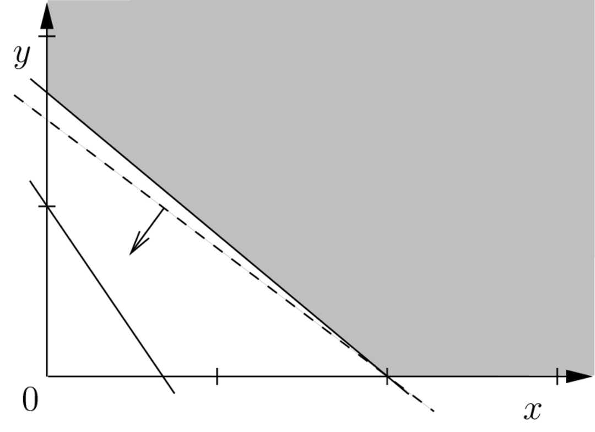
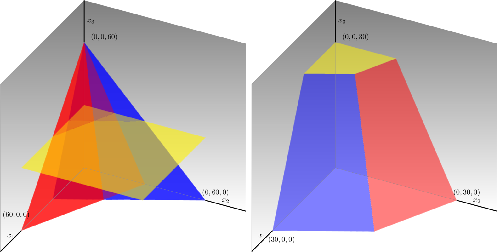
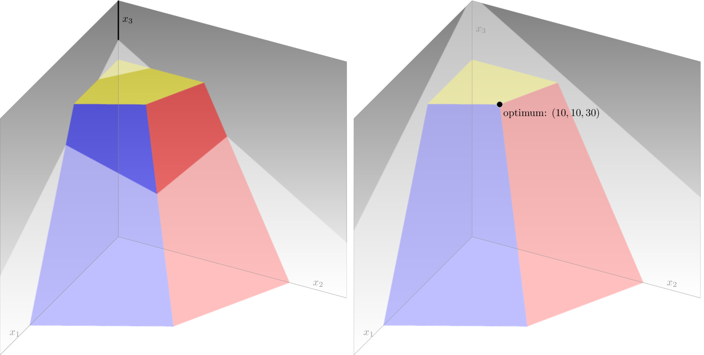

.. _intro:

.. pull-quote::

   Nothing in the world takes place without optimization, and there is no doubt that all aspects of the world that have a rational basis can be explained by optimization methods.  Leonhard Euler, 1744 (translation found in "Optimization Stories", edited by Martin Grötschel).

   
********************************************************************************
Introduction
********************************************************************************

.. todo
   duality: margin seminar
   knapsack and branch-and-bound: margin seminar

This introductory chapter is a run-up to Chapter 2 onwards.  It is an overview of mathematical optimization through some simple examples, presenting also the main characteristics of the solver used in this book: SCIP (http://scip.zib.de).

The rest of this chapter is organized as follows.
Section :ref:`matopt` introduces the basics of mathematical optimization and illustrates main ideas via a simple example.
Section :ref:`linopt` presents a real-world production problem to discuss concepts and definitions of linear-optimization model, showing details of SCIP/Python code for solving a production problem.
Section :ref:`intopt` introduces an integer optimization model by adding integer conditions to variables, taking as an example a simple puzzle sometimes used in junior high school examinations.
A simple transportation problem,  which is a special form of the linear optimization problem,  along with its solution is discussed in Section :ref:`transp`.  Here we show how to model an optimization problem as a function, using SCIP/Python.
Section :ref:`duality` explains duality, an important theoretical background of linear optimization, by taking a transportation problem as an example.
Section :ref:`mptransp` presents a multi-commodity transportation problem, which is an generalization of the transportation, and describes how to handle sparse data with SCIP/Python.
Section :ref:`mixtureXXXXX` introduces mixture problems as an application example of linear optimization.
Section :ref:`fractionXXXXX` presents the fraction optimization problem, showing two ways to reduce it to a linear problem.
Section :ref:`mkp` illustrates a knapsack problem with details of its solution procedure, including an explanation on how to debug a formulation.
Section :ref:`dietXXXXX` considers how to cope with nutritional problems, showing an example of an optimization problem with no solution.

.. _matopt:

Mathematical Optimization
============================

Let us start by describing what mathematical optimization is: it is the science of finding the “best” solution based on a given objective function, i.e., finding a solution which is at least as good and any other possible solution.  In order to do this, we must start by describing the actual problem in terms of mathematical formulas; then, we will need a methodology to obtain an optimal solution from these formulas.  Usually, these formulas consist of constraints, describing conditions that must be satisfied, and by an objective function.

In other words, a mathematical optimization problem is usually expressed as:
   - *objective function* (which we want to maximize of minimize);
   - *conditions of the problem:* constraint 1, constraint 2, ...

.. index::
   single: formulation in mathematical optimization
   single: variables
   single: constraints
   single: objective function
   single: minimize
   single: maximize
   single: optimum
   single: optimal solution

For the solution obtained to be meaningful, this model must capture the objective of optimization accurately, along with all essential problem requirements and details.  The steps for building an algebraic model of a mathematical optimization consists of defining:
  1. a set of *variables*: the unknowns that need to be found as a solution to the problem;
  2. a set of *constraints*: equations or inequalities that represent requirements in the problem as relationships between the variables
  3. an *objective function*: an expression, in terms of the defined variables, which determines e.g. the total cost, or the profit of the targeted problem.

The problem is a minimization when smaller values of the objective are preferrable, as with costs; it is a maximization when larger values are better, as with profits.  The essence of the problem is the same, whether it is a minimization or a maximization (one can be converted into the other simply by putting a minus sign in the objective function).

In this text, the problem is described by the following format.

   - **Maximize** or **minimize**

     - Objective function
       
   - **Subject to:**

     - Constraint 1
     - Constraint 2
     - ...

The optimization problem seeks a solution to either *minimize* or *maximize* the objective function, while satisfying all the constraints.  Such a desirable solution is called *optimum* or *optimal solution*  --- the best possible from all candidate solutions measured by the value of the objective function.  The variables in the model are typically defined to be non-negative real numbers.

There are many kinds of mathematical optimization problems; the most basic and simple is *linear optimization*\ [#f1-intro]_\ .  In a linear optimization problem, the objective function and the constraints are all linear expressions (which are straight lines, when represented graphically).  If our variables are :math:`x_1, x_2, \ldots, x_n`, a linear expression has the form :math:`a_1 x_1 + a_2 x_2 + \ldots + ax_n`, where :math:`a_1, \ldots, a_n` are constants.

For example,

.. math::
     & \mbox{minimize }        & & 3 x     +  4 y \\
     & \mbox{subject to: }     & & 5 x     +  6 y  \geq  10 \\
     &                         & & 7 x     +  5 y  \geq  5  \\
     &                         & & x,           y  \geq  0

is a linear optimization problem.

How does one derive such a model?  As an illustration, let us consider a simple business problem. A wine making company has orders for at least 10 barrels of desert wine. It may use grapes produced in its own vineyards (one thousand baskets yield 5 barrels) or bought in the neighborhood (the yield being 6 barrels per thousand baskets in this case). Processing one thousand baskets produced in its own vineyards requires 7 man-months, but processing the same quantity procured in the neighborhood requires only 5 man-month; the company committed to use a workforce of at least 5 man-months. The cost for producing grapes in the company’s vineyards is 3 euros per basket, whereas buying from neighbors costs 4 euros per basket.

.. index::
   single: non-negativity constraints
   single: sign restrictions

This problem is very simple but it is not immediately obvious what the company should do. First of all, let us consider the *variables* under its control: the amount of grapes to produce, and the amount to buy in the neighborhood. Let us call them :math:`x` and :math:`y`, respectively, and their unit be one thousand baskets. If the aim of the company is to minimize total cost, the function that represents it is :math:`3 x + 4 y`; this is the *objective* that the company wants to minimize. There are *constraints*: the first, requiring the production to be at least the quantity ordered, can be stated as :math:`5 x + 6 y \geq 10`; the second, related to the use of workforce, can be written as :math:`7 x + 5 y \geq 5`. The third constraints force the quantities :math:`x` and :math:`y` to be non-negative real numbers and are commonly referred to as *non-negativity constraints*, or as *sign restrictions*.

This optimization problem can now be stated as a the previous mathematical model.

As there are only two variables, this model can be represented graphically on the 2-dimensional Cartesian coordinate system. As the variables are non-negative, the region of interest is the first quadrant. There is a straight line related to each of the constraints; e.g., on the limit of the quantity produced :math:`5 x + 6 y = 10`. If we represent this line, it will divide the space into two regions: one where all the points satisfy the constraint, and the other where none satisfy the constraint. These are called *halfspaces*; the region that satisfies all constraints is shadowed in Figure :ref:`simplelp`.

As for the objective function, a straight line :math:`3000x + 4000y = z` represents all the points in the space with a given value :math:`z` of the cost; an example is the dashed line in Figure :ref:`simplelp`. By changing the value of :math:`z`, this line can be moved parallel to itself and we may want to do this along the direction of minimization for finding the optimum. In fact, the last point in the feasible region that intersects this line satisfies all constraints and indeed happens to be the optimum.

.. _simplelp:

   Feasible region

   A simple linear-optimization model with two variables.

One of the important features of linear optimization problems is that they are easy to solve.  Common texts on mathematical optimization describe in lengthy detail how a linear optimization problem can be solved.  Taking the extreme case, for most practitioners, how to solve a linear optimization problem is not important.  For details on how methods for solving these problems have emerged, see :ref:`margin seminar 1`.  Most of the software packages for mathematical optimization support linear optimization.  Given a description of the problem, an optimum solution (i.e., a solution that is guaranteed to be the best answer) to most of the practical problems can be obtained in an extremely short time.

Unfortunately, not all the problems that we find in the real world can be described as a linear optimization problem.  Simple linear expressions are not enough to accurately represent many complex conditions that occur in practice.  In general, optimization problems that do not fit in the linear optimization paradigm are called *nonlinear optimization* problems.

In practice, nonlinear optimization problems are often difficult to solve in a reliable manner.  Using the mathematical optimization solver covered in this document, SCIP, it is possible to efficiently handle some nonlinear functions; in particular, quadratic optimization (involving functions which are a polynomial of up to two, such as :math:`x^2 + xy`) is well supported, especially if they are convex.

.. index::
   single: integer optimization
   single: mixed-integer optimization

A different complication arises when some of the variables must take on integer values; in this situation, even if the expressions in the model are linear, the general case belongs to a class of difficult problems (technically, the NP-hard class [#f2-intro]_).  Such problems are called integer optimization problems; with ingenuity, it is possible to model a variety of practical situations under this paradigm.  The case where some of the variables are restricted to integer values, and other are continuous, is called a *mixed-integer* optimization problem.  Even for solvers that do not support nonlinear optimization, some techniques allow us to use mixed-integer optimization to approximate arbitrary nonlinear functions; these techniques (piecewise linear approximation) are described in detail in Chapter :ref:`piecewise`.

.. _linopt:

Linear Optimization
===================

We begin with a simple linear optimization problem; the goal is to explain the terminology commonly used optimization.

Consider the following situation.  A wine making company want to know how to blend the wines produced in 2015 into the brands it commercializes.  Wines belong to three different grape varieties: Alfrocheiro (A), Baga (B) and Castelão (C). The brands are Queijas (Q), Ramada (R) and Salto (S). The proportions required for each of them, as well as the number of pure-grape wine barrels available, and profit associated with each blend, are provided in Table :ref:`wines`.

.. _wines:

.. table:: The wine blending problem.

    =============     ==========    ========    ========     ===============
    \                 Q Queijas     R Ramada    S Salto      *availability*
    =============     ==========    ========    ========     ===============
    A Alfrocheiro     2             1           1            60 
    B Baga            1             2           1            60 
    C Castelão                                  1            20 
    *profit*          15            18          30            
    =============     ==========    ========    ========     ===============

We immediately reveal the mathematical model that describes this situation.

.. math::

     & \mbox{maximize }        & 15 x_1  & {}+{} & 18 x_2 & {}+{} & 30 x_3  \\
     & \mbox{subject to: }     & 2  x_1  & {}+{} & x_2    & {}+{} &    x_3   & \leq & 60 \\
     &                         &    x_1  & {}+{} & 2 x_2  & {}+{} &    x_3   & \leq & 60 \\
     &                         &         &       &        &       &    x_3   & \leq & 30 \\
     &                         &    x_1, &       & x_2,   &       &    x_3   & \geq & 0

    
.. index::
   single: continuous variables
   single: real variables
   single: constraints
   single: objective function
   single: optimum
   single: optimum solution
   single: linear optimization problem

In this case the *variables* --- the unknown values whose magnitude we want to determine --- are the amounts of each brand Queijas, Ramada, and Salto to be produced; we call them :math:`x_1`, :math:`x_2` and :math:`x_3`.

The first expression,  :math:`15 x_1 + 18 x_2 + 30 x_3`,  determines the total profit in terms of the variables; this defines the function that we want to maximize, which is called the *objective function*.

The second and subsequent expressions limit restrict the value of the variables  :math:`x1, x2, x3` and are commonly referred to as *constraints*.  Constraints are related to the availability of each resource (2015 single-variety wines).  For example, the total quantity of variety A used is :math:`2 x_1 + x_2 + x_3`; therefore, the corresponding constraint is :math:`2 x_1 + x_2 + x_3 \leq 60`.  Each variable :math:`x_1, x_2, x_3` can take any non-negative real value; hence, these are called *real*, or *continuous* variables.

This problem contains only linear expressions: each expression contains a sum of terms, each with a variable :math:`x_1, x_2, x_3` multiplied by a constant.

Such a problem, where we are maximizing (or minimizing) a linear objective subject to linear constraints, with continuous variables, is a *linear optimization problem*.

An instantiation of the variables :math:`(x_1, x_2, x_3)` satisfying all the constraints is called a *feasible solution*; the set of all feasible solutions is the *feasible region*.  Among feasible solutions, *optimum solutions* (or optimal solutions) are those which maximize (or minimize) the objective.  In general, there may be more than one optimum solution, but typically the purpose is to determine one of them.  The maximum (or minimum) value of the objective function is referred to as the best objective value, or *optimum*.

In this case the graphical representation of the constraints is more difficult than in the 2-dimensional case, but it is still possible,  as shown in Figure :ref:`lp2`.  For the first constraint :math:`2x_1  + x_2   + x_3  \leq 60`, all points :math:`(x_1, x_2, x_3)` satisfying it at equality (:math:`2x_1  + x_2   + x_3  = 60`) describe a plane in 3-dimension (represented in blue in Figure :ref:`lp2`).  Points on that plane and below it (i.e., on the same side as the origin) are feasible; technically, this is called the feasible half-space corresponding to this constraint.  The intersection of the halfspaces given by the three inequalities of this model and the non-negativity constraints :math:`x_1 \ge 0` , :math:`x_2 \ge 0` and :math:`x_3 \ge 0` forms a non-empty 3-dimensional object (technically known as a  *polyhedron*; in this case, as it is bounded, it is also a *polytope*), which is the feasible region.

.. _lp2:

   Polytope

   Left: planes :math:`2x_1+ x_2 + x_3 = 60` (red), :math:`x_1+2x_2+x_3 =60` (blue) and :math:`x_3=30` (yellow).
   Right: the feasible region's polytope. 

The objective function of this optimization model can be represented graphically as a plane in 3-dimension given by :math:`z = 15 x_1 +18 x_2 + 30 x_3`, where :math:`z` is some arbitrary real number. If we move this plane in parallel, the value of :math:`z` increases in one direction and decreases in the other. If we continue moving it in the direction of increasing :math:`z`, the last point of the feasible region intersecting with the plane gives the optimum, which is the maximum value of the objective function, as illustrated in Figure :ref:`lp3`. 

.. _lp3:

   Optimum vertex

   Left: the plane :math:`z = 15 x_1   + 18 x_2  + 30 x_3 = 1000`, corresponding to an objective of 1000, and the feasible region.
   Right: Moving the plane upwards in parallel leads to the optimum: the last point of the region being intersected, :math:`x_1=10, x_2=10, x_3 = 30, z = 1230`.

.. index::
   single: SCIP
   single: Python
   single: pyscipopt

Finding such point can be explored in some methodical way; this is what a linear optimization solver does for finding the optimum.  Without delay, we are going to see how to solve this example using the SCIP solver.  SCIP has been developed at the Zuse Institute Berlin (ZIB), an interdisciplinary research institute for applied mathematics and computing.  SCIP solver can be called from several programming languages; for this book we have chosen the very high-level language *Python*.  For more information about SCIP and Python, see appendices :ref:`SCIPintro` and :ref:`PYTHONintro`, respectively.

The first thing to do is to read definitions contained in the SCIP module (a *module* is a different file containing programs written in Python).   The SCIP module is called ``pyscipopt``, and functionality defined there can be accessed with:

::

  from pyscipopt import Model, quicksum, multidict

The instruction for using a module is ``import``.
In this statement we are importing the definitions of ``Model``, ``quicksum``, and ``multidict``.  We could also have used ``from pyscipopt import *``, where the asterisk means to import all the definitions available in ``pyscipopt``.
.. ; we have imported just some of them, and we could have used other idioms, as we will see later.
One of the features of Python is that, if the appropriate module is loaded, a program can do virtually anything [#f3-intro]_.

The next operation is to create an optimization model; this can be done with the ``Model`` class, which we have imported from the ``pyscipopt`` module.

::

    model = Model("Wine blending")

With this instruction, we create an object named ``model``, belonging the class ``Model`` (more precisely, ``model`` is a *reference* to that object).  The model description is the (optional) string ``"Wine blending"``, passed as an argument.

There is a number of actions that can be done with objects of type ``Model``, allowing us to add variables and constraints to the model before solving it.  We start defining variables :math:`x_1, x_2, x_3` (in the program, ``x1, x2, x3``).  We can generate a variable using the method ``addVar`` of the model object created above (a *method* is a function associated with objects of a class).  For example, to generate a variable ``x1`` we use the following statement:

::

    x1 = model.addVar(vtype="C", name="x1")

With this statement, the method ``addVar`` of class ``Model`` is called, creating a variable ``x1`` (to be precise, ``x1`` holds a reference to the variable object).  In Python, *arguments* are values passed to a function or method when calling it (each argument corresponds to a *parameter* that has been specified in the function definition).  Arguments to this method are specified within parenthesis after ``addVar``.  There are several ways to specify arguments in Python, but the clearest way is to write ``argument name = argument value`` as a *keyword argument*.   

Here, ``vtype = "C"`` indicates that this is a continuous variable, and ``name = "x1"`` indicates that its name (used, e.g., for printing) is the string ``"x1"``.  The complete signature (i.e., the set of parameters) for the ``addVar`` method is the following:

::

    addVar(name="", vtype="C", lb=0.0, ub=None, obj=0.0, pricedVar = False)

Arguments are, in order, the name, the type of variable, the lower bound, the upper bound, the coefficients in the objective function.  The last parameter, ``pricedVar`` is used for *column generation*, a method that will be explained in Chapter :ref:`bpp+csp`.  In Python, when calling a method omitting keyword arguments (which are optional) default values (given after ``=``) are applied.  In the case of ``addVar``, all the parameters are optional.  This means that if we add a variable with ``model.addVar()``, SCIP will create a continuous, non-negative and unbounded variable, whose name is an empty string, with coefficient 0 in the objective (``obj=0``).  The default value for the lower bound is specified with ``lb=0.0``, and the upper bound ``ub`` is implicitly assigned the value infinity (in Python, the constant ``None`` usually means the absence of a value).  When calling a function or method, keyword arguments without a default value cannot be omitted.

Functions and methods may also be called by writing the arguments without their name, in a predetermined order, as in:

::

    x1 = model.addVar("x1", "C", 0, None, 15)

Other variables may be generated similarly.  Note that the third constraint :math:`x 3 \leq 30` is the upper bound constraint of variable :math:`x_3`, so we may write ``ub = 30`` when declaring the variable.

    
.. index::
   single: linear expression

Next, we will see how to enter a constraint.  For specifying a constraint, we will need to create a *linear expression*, i.e., an expression in the form of :math:`c_1 x_1 + c_2 x2 + \ldots + c_n x_n`, where each :math:`c_i` is a constant and each :math:`x_i` is a variable. We can specify a linear constraint through a relation between two linear expressions.  In SCIP’s Python interface, the constraint :math:`2x1 + x2 + x3 \leq 60` is entered by using method ``addConstr`` as follows:

::

    model.addConstr(2*x1 + x2 + x3 <= 60)

The signature for ``addConstr`` (ignoring some parameters which are not of interest now) is:

::

    addConstr(relation, name="", ...)

.. index::
   single: left-hand side
   single: right-hand side
   single: lhs
   single: rhs

SCIP supports more general cases, but for the time being let us concentrate on linear constraints.  In this case, parameter ``relation`` is a linear constraint, including a *left-hand side* (lhs), a *right-hand side* (rhs), and the sense of the constraint. Both *lhs* and *rhs* may be constants, variables, or linear expressions; *sense* maybe ``"<="`` for less than or equal to, ``">="`` for greater than or equal to, or ``"=="`` for equality. The name of the constraint is optional, the default being an empty string. Linear constraints may be specified in several ways; for example, the previous constraint could be written equivalently as:

::

    model.addConstr(60 >= 2*x1 + x2 + x3)

Before solving the model, we must specify the objective using the ``setObjective`` method, as in:

::

    model.setObjective(15*x1 + 18*x2 + 30*x3, "maximize")

.. index::
   single: objective
   single: maximize
   single: minimize
   single: model sense

The signature for ``setObjective`` is:

::

    setObjective(expression, sense="minimize", clear="true"):
   
The first argument of ``setObjective`` is a linear (or more general) expression, and the second argument specifies the direction of the objective function with strings ``"minimize"`` (the default) or ``"maximize"``.  (The third parameter, ``clear``, if ``"true"`` indicates that coefficients for all other variables should be set to zero.)  We may also set the direction of optimization using ``model.setMinimize()`` or ``model.setMaximize()``.

At this point, we can solve the problem using the method ``optimize`` of the ``model`` object:

::

    model.optimize()

After executing this statement --- if the problem is feasible and bounded, thus allowing completion of the solution process ---, we can output the optimal value of each variable. This can be done through method ``getVal`` of ``Model`` objects; e.g.:

::

    print(model.getVal(x1))

The complete program for solving our model can be stated as follows:

.. literalinclude:: ./SCIP/STRIPPED/lo_wines_simple.py
   :linenos:

If we execute this Python program, the output will be:

.. code-block:: none
   :linenos:

   [solver progress output]
   Optimal value: 1230.0
   Solution:
     x1 =  10.0
     x2 =  10.0
     x3 =  30.0

The first lines, not shown, report progress of the SCIP solver (this can be suppressed) while lines 2 to 6 correspond to the output instructions of lines 14 to 16 of the previous program.

.. NOTE::

   **Margin seminar 1**

   *Linear programming*

   Linear programming was proposed by George Dantzig in 1947, based on the work of three Nobel laureate economists: Wassily Leontief, Leonid Kantrovich, Tjalling Koopmans.  At that time, the term used was "optimization in linear structure", but it was renamed as "linear programming" in 1948, and this is the name commonly used afterwards.  The simplex method developed by Dantzig has long been the almost unique algorithm for linear optimization problems, but it was pointed out that there are (mostly theoretical) cases where the method requires a very long time.

   The question as to whether linear optimization problems can be solved efficiently in the theoretical sense (in other words, whether there is an algorithm which solves linear optimization problems in polynomial time) has been answered when the ellipsoid method was proposed by Leonid Khachiyan (Khachian), of the former Soviet Union, in 1979.  Nevertheless, the algorithm of Khachiyan was only theoretical, and in practice the supremacy of the simplex method was unshaken.  However, the interior point method proposed by Narendra Karmarkar in 1984 [#f6-intro]_ has been proved to be theoretically efficient, and in practice it was found that its performance can be similar or higher than the simplex method's.  The currently available optimization solvers are usually equipped with both the simplex method (and its dual version, the *dual simplex method*) and with interior point methods, and are designed so that users can choose the most appropriate of them.
.. how is it in Python/SCIP?

   
.. _intopt:

Integer Optimization
====================

For many real-world optimization problems, sometimes it is necessary to obtain solutions composed of integers instead of real numbers. For instance, there are many puzzles like this: *“In a farm having chicken and rabbits, there are 5 heads and 16 feet. How many chicken and rabbits are there?”*  Answer to this puzzle is only meaningful if the solution has integer values only.

Let us consider a concrete puzzle.

.. case study
.. compound::

   Adding the number of heads of cranes, turtles and octopuses totals 32, and the number of legs sums to 80.  What are the minimum numbers of turtles and octopuses?

   
For formulating this problem in integer optimization, we define the variable :math:`x` to be the number of cranes, :math:`y` to be the number of turtles, and :math:`z` to be the number of octopuses. This being done, it becomes clear that our objective is to :math:`\mbox{minimize } y + z`. We now have to specify the constraints.

First, concerning the number of heads, there must be :math:`x+y+z = 32`. Cranes have two legs each, turtles have four legs each, and each octopus has eight legs. Therefore, we must have :math:`2x + 4y + 8z = 80`. We obtain the complete model after adding the non-negativity constraints.

.. math::

     & \mbox{minimize }        &         &       &    y   & {}+{} &    z     \\
     & \mbox{subject to: }     &    x    & {}+{} &    y   & {}+{} &    z     & \; = \; & 32 \\
     &                         &  2 x    & {}+{} &  4 y   & {}+{} &  8 z     & \; = \; & 80 \\
     &                         &    x,   &       &    y,  &       &    z     & \; \geq \; & 0

When we use a linear optimization solver, we obtain the solution :math:`x = 29.3333, y = 0, z = 2.66667`. This is obviously a strange answer; when animals are being put as food on the shelves splitting is possible, but not when they are alive. To solve this model, we need to add conditions to force the variables to have integer values; these are called *integrality constraints*: :math:`x, y, z` must be non-negative integers. Linear optimization problems with conditions requiring variables to be integers are called *integer optimization problems*. For the puzzle we are solving, thus, the correct model is:

.. math::

     & \mbox{minimize }        &         &       &    y   & {}+{} &    z  \\
     & \mbox{subject to: }     &    x    & {}+{} &    y   & {}+{} &    z  & \; = \; & 32 \\
     &                         &  2 x    & {}+{} &  4 y   & {}+{} &  8 z  & \; = \; & 80 \\
     &                         &    x,   &       &    y,  &       &    z  & \; \geq \;  &  0, \mbox{integer}

Below is a simple Python/Gurobi program for solving it. The main difference with respect to the programs that we have seen before concerns the construction of variables; in this case, there is an argument to ``addVar`` for specifying that variables are integer: ``vtype="I"``. Continuous variables (the default) can be explicitly declared with ``vtype="C"``, and binary variables --- a special case of integers, restricted to the values 0 or 1 --- are declared with ``vtype="B"``.     Parameter ``vtype``\ ’s values ``"C"``, ``"I"``, and ``"B"`` are shorthands for ``GRB.CONTINUOUS``, ``GRB.INTEGER``, and ``GRB.BINARY``, respectively. 

.. code-block:: python
   :linenos:

    from gurobipy import *
    model = Model("puzzle")
    x = model.addVar(vtype="I", name="x")
    y = model.addVar(vtype="I", name="y")
    z = model.addVar(vtype="I", name="z")
    model.update()
    model.addConstr(x + y + z == 32,"Heads")
    model.addConstr(2*x + 4*y + 8*z == 80,"Legs")
    model.setObjective(y + z, GRB.MINIMIZE)
    model.optimize()
    print "Opt. Val.=", model.ObjVal
    print "(x,y,z)=", x.X, y.X, z.X

For small integer optimization problems like this, the answer can be quickly found: :math:`x=28`, :math:`y=2`, and :math:`z=2`. Notice that this solution is completely different of that of the continuous version; in general, we cannot guess the value of an integer solution from the continuous model. For any integer-optimization problem, by “relaxing” the integer requirements on its variables to non-negative real numbers, we get back to its linear-optimization counterpart, called *linear-optimization relaxation*.

In general, integer-optimization problems are much harder to solve when compared to linear-optimization problems. Indeed, linear optimization falls in a class of problems that computer scientists call *easy*, meaning there are algorithms for solving these problems that require resources like CPU time or memory growing polynomially on the size of the problem instance. The same cannot be said for problems with integer variables; the general class of integer optimization problems is called NP-complete, and until now all known algorithms for problems in this class require resources that, in the worst case, grow exponentially with the size of the instance (see Figure :ref:`fngrowth`). One interesting property of NP-complete problems is that a polynomial algorithm for one of them would also solve all the others within polynomial resources. Some problems are said to be NP-hard; this means that their solution is at least as difficult as that of an NP-complete problem.

.. _fngrowth
.. figure::	FIGS/fngrowth.png
   :scale: 50 %
   :align: center

   Exponential growth

   Growth of the functions: linear (:math:`x`), quadratic (:math:`x^2`), and exponential (:math:`e^x`); :math:`x` ranges from 0 to 5 on the left figure, and from 0 to 10 on the right.

Specialized solution techniques have to be used to isolate and capture the integer solutions. It should be noted that a feasible solution to an integer-optimization model is always a feasible solution to its linear-optimization relaxation. Moreover, the value of the optimal solution to the linear-programming relaxation provides a bound to its integer-optimization counterpart. This information plays a vital role in designing solution methods for integer-optimization problems, which will be discussed throughout this book.

[`source code <PROGS/puzzle.py>`_]

.. _transp:

Transportation Problem
======================

.. index::
   single: transportation

The problems discussed so far generally address optimization issues for transforming certain materials to certain products. These problems typically require inequality constraints having coefficients assigned to the variables for capturing the transformation relationships; the right-hand-side typically denotes needs or restrictions on resources --- such as demand or production capacity. In this section, we will consider an entirely new group of problems that have much simpler constraint structures. General instances of these problems typically concern transportation of goods from suppliers to customers for meeting the demands, without exceeding supplier capacities. Different routes from suppliers to customers give various options for optimization, each having an associated cost, and an optimal solution is a minimum-cost transportation route for meeting the demands.

.. _ftransp:
.. figure:: FIGS/transK.png
   :scale: 50 %
   :align: center

   Transportation problem

   Graph representation of a transportation problem and its optimal transport volume
   
In Table :ref:`ttransp`, :math:`d_i` is the demand of the customer :math:`i`, where :math:`i =` 1 to 4. Each plant :math:`j` can supply its customers with goods but their production capacities are limited by :math:`M_j`, where :math:`j =` 1 to 3. Transportation cost for shipping goods from Plant :math:`i` to Customer :math:`j` is given in the table by :math:`c_{ij}`.

.. _ttransp:

.. table:: Data for the transportation problem: transportation cost, capacities and demand,

   +----------------------+--+------------+----------+----------+----------+----------+----------------------+
   |                      |  |                      Customers :math:`i`               |                      |
   +----------------------+--+------------+----------+----------+----------+----------+----------------------+
   | Transportation       |  |            |          |          |          |          |                      |
   | cost :math:`c_{ij}`  |  |      1     |    2     |    3     |    4     |    5     | capacity :math:`M_j` |
   +======================+==+============+==========+==========+==========+==========+======================+
   |                      | 1| 4          | 5        | 6        | 8        | 10       | 3000                 |
   +                      +--+------------+----------+----------+----------+----------+----------------------+
   |                      | 2| 6          | 4        | 3        | 5        |  8       | 3000                 |
   + plant :math:`j`      +--+------------+----------+----------+----------+----------+----------------------+
   |                      | 3| 9          | 7        | 4        | 2        |  4       | 3000                 |
   +----------------------+--+------------+----------+----------+----------+----------+----------------------+
   | demand :math:`d_i`   |  |  80        | 270      | 250      | 160      | 180      |                      |
   +----------------------+--+------------+----------+----------+----------+----------+----------------------+

Data for an instance of the transportation problem.

A linear-optimization model of this transportation problem can be formulated rather easily by defining a variable :math:`x_{ij}` as the amount of goods to be shipped from plant :math:`j` to customer :math:`i`, where :math:`i = 1` to :math:`5` and :math:`j = 1` to :math:`3`. The objective is to find a minimum-cost solution for meeting the customer demands without exceeding production capacity at any plant.

.. math::
    &\mbox{ minimize }     & \sum_{i=1}^n \sum_{j=1}^m c_{ij} x_{ij}  &     \\
    &\mbox{ subject to   } & \sum_{j=1}^m x_{ij} =d_i &  \forall  i=1,\ldots,n  \\
    &                      & \sum_{i=1}^n x_{ij} \leq M_j &  \forall  j=1,\ldots,m  \\   
    &                      & x_{ij} \geq 0 & \forall  i=1,\ldots,n, j=1,\ldots,m  

The minimum total cost for meeting the demands is the objective function value to be given by an optimal solution to the problem. The first set of constraints require the demands to be satisfied while the second set of constraints ensure that production capacity is not violated.

One possibility for writing a program for solving this instance is the following.

.. code-block:: python
   :linenos:

    from gurobipy import *
    I,d = multidict({1:80, 2:270, 3:250 , 4:160, 5:180})
    J,M = multidict({1:500, 2:500, 3:500})
    c = {(1,1):4,    (1,2):6,    (1,3):9,
         (2,1):5,    (2,2):4,    (2,3):7,
         (3,1):6,    (3,2):3,    (3,3):4,
         (4,1):8,    (4,2):5,    (4,3):3,
         (5,1):10,   (5,2):8,    (5,3):4,
         }
    model = Model("transportation")
    x = {}
    for i in I:
        for j in J:
            x[i,j] = model.addVar(vtype="C", name="x[%s,%s]" % (i, j))
    model.update()
    for i in I:
        model.addConstr(quicksum(x[i,j] for j in J if (i,j) in x) == d[i], name="Demand[%s]" % i)
    for j in J:
        model.addConstr(quicksum(x[i,j] for i in I if (i,j) in x) <= M[j], name="Capacity[%s]" % j)
    model.setObjective(quicksum(c[i,j]*x[i,j]  for (i,j) in x), GRB.MINIMIZE)
    model.optimize()
    print "Optimal value:", model.ObjVal
    EPS = 1.e-6
    for i,j in x:
        if x[i,j].X > EPS:
            print "sending quantity %10g from factory %3d to customer %3d" % (x[i,j].X, j, i)

We are defining all the data as Python dictionaries; the demand ``d`` has the customers as key, the capacity ``M`` has the plants as key, and the transportation cost ``c`` is a dictionary associating pairs customer-plants that can supply it to the corresponding cost. This code is concise, but we are mixing data and the model. A better approach is to have the model isolated from data, in a Python function, which we may reuse for solving different instances of the same model. In this case, the model can be written as

.. code-block:: python
   :linenos:

    def transp(I, J, c, d, M):
        model = Model("transportation")
        x = {}
        for i in I:
            for j in J:
                x[i,j] = model.addVar(vtype="C", name="x[%s,%s]" % (i, j))
        model.update()
        for i in I:
            model.addConstr(quicksum(x[i,j] for j in J if (i,j) in x) == d[i], name="Demand[%s]" % i)
        for j in J:
            model.addConstr(quicksum(x[i,j] for i in I if (i,j) in x) <= M[j], name="Capacity[%s]" % j)
        model.setObjective(quicksum(c[i,j]*x[i,j]  for (i,j) in x), GRB.MINIMIZE)
        model.update()
        model.__data = x
        return model

We can now define the data elsewhere, and build the Gurobi model for it.  Here is an example:

.. code-block:: python
   :linenos:

    I,d = multidict({1:80, 2:270, 3:250 , 4:160, 5:180})
    J,M = multidict({1:500, 2:500, 3:500})
    c = {(1,1):4,    (1,2):6,    (1,3):9,
         (2,1):5,    (2,2):4,    (2,3):7,
         (3,1):6,    (3,2):3,    (3,3):4,
         (4,1):8,    (4,2):5,    (4,3):3,
         (5,1):10,   (5,2):8,    (5,3):4,
         }

    model = transp(I, J, c, d, M)
    model.optimize()
    print "Optimal value:", model.ObjVal
    EPS = 1.e-6
    x = model.__data
    for i,j in x:
        if x[i,j].X > EPS:
            print "sending quantity %10g from factory %3d to customer %3d" % (x[i,j].X, j, i)

The data is specified in lines 1 to 8, and the model is constructed by calling the function ``transp`` with that data as arguments (line 10). We then optimize the model and access the optimal solution. Notice that the way we use for passing model information is to add an attribute ``.__data`` to the ``model`` variable (lines 17 and 15, respectively, in the two above programs). We are using it for having access to the variable dictionary ``x`` outside the ``transp`` function; we will use this idiom to share more, different information whenever required. When we execute the above program, Python will generate the following output:

.. code-block:: none
   :linenos:

    Optimize a model with 8 rows, 15 columns and 30 nonzeros
    Presolve time: 0.00s
    Presolved: 8 rows, 15 columns, 30 nonzeros

    Iteration    Objective       Primal Inf.    Dual Inf.      Time
           0    3.3500000e+03   2.000000e+01   0.000000e+00      0s
           1    3.3700000e+03   0.000000e+00   0.000000e+00      0s

    Solved in 1 iterations and 0.00 seconds
    Optimal objective  3.370000000e+03
    Optimal value: 3370.0
    sending quantity        230 from factory   2 to customer   3
    sending quantity         20 from factory   3 to customer   3
    sending quantity        160 from factory   3 to customer   4
    sending quantity        270 from factory   2 to customer   2
    sending quantity         80 from factory   1 to customer   1
    sending quantity        180 from factory   3 to customer   5

Lines 1 to 11 are Gurobi’s optimization log, and lines 12 to 17 correspond to the print instruction of the previous program (line 18).

[`source code <PROGS/transp.py>`_]

.. _mptransp:

Multi-product Transportation Problem
====================================

In the previous transportation problem, we considered only one kind of goods produced at the production plants. In the real-world, however, that is a very restrictive scenario: A producer typically produces many different kinds of products and the customers typically demand different sets of the products available from the producers. Moreover, some producers may be specialized into producing only certain kinds of products while some others may only supply to certain customers. Therefore, a general instance of the transportation problem needs to be less restrictive and account for many such possibilities.

.. figure:: FIGS/mctranspK.png
   :scale: 50 %
   :align: center

   Multicommodity transportation

   Graph representation for a multicommodity transportation problem.  Suppliers are represented as squares and clients as circles; thick lines represent arcs actually used for transportation in a possible solution, and colors in arcs mean different products.

A more general version of the transportation problem is typically studied as a multi-commodity transportation model. A linear-optimization model can be built using decision variables :math:`x_{ijk}` where :math:`i` denotes the customer, :math:`j` denotes the production plant and :math:`k` denotes the product type. Customer demand is indexed by :math:`i` and :math:`k` to denote the customer and product type. Then the model can be stated as follows.

.. math::
    & \mbox{ minimize }    & \sum_{i=1}^n \sum_{j=1}^m \sum_{k=1}^K c_{ijk} x_{ijk}  &     \\
    & \mbox{ subject to }  & \sum_{j=1}^m x_{ijk} =d_{ik} &  \mbox{ for }  i=1,\cdots,n, k =1,\cdots,K  \\
    &                      & \sum_{i=1}^n \sum_{k=1}^K x_{ijk} \leq M_j &  \mbox{ for }  j=1,\cdots,m  \\   
    &                      & x_{ijk} \geq 0 & \mbox{ for }  i=1,\cdots,n, j=1,\cdots,m, k=1,\cdots,K  

Note that the objective function addresses the minimum total cost for all possible cost combinations involving customers, production plants and product types. The first set of constraints ensure that all demands of the product types from the customers are met exactly while the second set of constraints ensure that capacity at each production plant is not exceeded by taking into account all product types and all customers.

A model for this in Python/Gurobi can be written as follows:

.. code-block:: python
   :linenos:

    def mctransp(I, J, K, c, d, M):
        model = Model("multi-commodity transportation")
        x = {}
        for i,j,k in c:
            x[i,j,k] = model.addVar(vtype="C", name="x[%s,%s,%s]" % (i, j, k))
        model.update()
        for i in I:
            for k in K:
                model.addConstr(quicksum(x[i,j,k] for j in J if (i,j,k) in x) == d[i,k], "Demand[%s,%s]" % (i,k))
        for j in J:
            model.addConstr(quicksum(x[i,j,k] for (i,j2,k) in x if j2 == j) <= M[j], "Capacity[%s]" % j)
        model.setObjective(quicksum(c[i,j,k]*x[i,j,k]  for i,j,k in x), GRB.MINIMIZE)
        model.update()
        model.__data = x
        return model

Variables are created in line 5. In lines 9 and 10 we create a list the variables that appear in each demand-satisfaction constraint, and the corresponding coefficients; these are then used for creating a linear expression, which is used as the left-hand side of a constraint in line 11. Capacity constraints are created in a similar way, in lines 13 to 15. For an example, consider now the same three production plants and five customers as before. Plant 1 produces two products, football and volleyball; it can supply football only to Customer 1 and volleyball to all five customers. Plant 2 produces football and basketball; it can supply football to Customers 2 and 3, basketball to Customers 1, 2 and 3. Plant 3 produces football, basketball and rugby ball; it can supply football and basketball to Customers 4 and 5, rugby ball to all five customers.

Let us specify the data for this problem in a Python program. First of all, we must state what products each of the plants can manufacture; on dictionary ``produce`` the key is the plant, to which we are associating a list of compatible products. We also create a dictionary ``M`` with the capacity of each plant (3000 units, in this instance).

.. code-block:: python

    J,M = multidict({1:3000, 2:3000, 3:3000})
    produce = {1:[2,4], 2:[1,2,3], 3:[2,3,4]}

The demand for each of the customers can be written as a double dictionary: for each customer, we associate a dictionary of products and quantities demanded.

.. code-block:: python

    d = {(1,1):80,   (1,2):85,   (1,3):300,  (1,4):6,
         (2,1):270,  (2,2):160,  (2,3):400,  (2,4):7,
         (3,1):250,  (3,2):130,  (3,3):350,  (3,4):4,
         (4,1):160,  (4,2):60,   (4,3):200,  (4,4):3,
         (5,1):180,  (5,2):40,   (5,3):150,  (5,4):5
         }
    I = set([i for (i,k) in d])
    K = set([k for (i,k) in d])

For determining the transportation cost, we may specify the unit weight for each product and the transportation cost per unit of weight; then, we calculate :math:`c_{ijk}` as their product:

.. code-block:: python

    weight = {1:5, 2:2, 3:3, 4:4}
    cost = {(1,1):4,  (1,2):6, (1,3):9,
            (2,1):5,  (2,2):4, (2,3):7,
            (3,1):6,  (3,2):3, (3,3):4,
            (4,1):8,  (4,2):5, (4,3):3,
            (5,1):10, (5,2):8, (5,3):4
            }
    c = {}
    for i in I:
        for j in J:
            for k in produce[j]:
                c[i, j, k] = cost[i,j] * weight[k]

We are now ready to construct a model using this data, and solving it:

.. code-block:: python

    model = mctransp(c,d,M)
    model.optimize()
    print "Optimal value:", model.ObjVal
    EPS = 1.e-6
    x = model.__data
    for i,j,k in x:
        if x[i,j,k].X > EPS:
            print "sending %10g units of %3d from plant %3d to customer %3d" % (x[i,j,k].X, k, j, i)

If we execute this Python program, the output is the following:

.. code-block:: none
   :linenos:

    Optimize a model with 18 rows, 40 columns and 70 nonzeros
    Presolve removed 18 rows and 40 columns
    Presolve time: 0.00s
    Presolve: All rows and columns removed
    Iteration    Objective       Primal Inf.    Dual Inf.      Time
           0    1.7400000e+04   0.000000e+00   0.000000e+00      0s
     
    Solved in 0 iterations and 0.00 seconds
    Optimal objective  1.740000000e+04
    Optimal value: 17400.0
    sending      100.0 units of   2 from plant   3 to customer   4
    sending      210.0 units of   3 from plant   3 to customer   3
    sending       40.0 units of   3 from plant   2 to customer   3
    sending       40.0 units of   1 from plant   2 to customer   1
    sending       10.0 units of   3 from plant   2 to customer   1
    sending      100.0 units of   2 from plant   1 to customer   2
    sending      100.0 units of   3 from plant   2 to customer   2
    sending       70.0 units of   1 from plant   2 to customer   2
    sending       60.0 units of   1 from plant   2 to customer   4
    sending       30.0 units of   2 from plant   1 to customer   1
    sending      180.0 units of   1 from plant   2 to customer   5

Readers may have noticed by now that for these two transportation problems, even though we have used linear-optimization models to solve them, the optimal solutions are integer-valued --- as if we have solved integer-optimization models instead. This is because of the special structures of the constraints in the transportation problems that allow this property, commonly referred to as *unimodularity*. This property has enormous significance because, for many integer-optimization problems that can be modeled as transportation problems, we only need to solve their linear-optimization relaxations.

[`source code <PROGS/mctransp.py>`_]

.. _duality:

Duality
-------

.. index::
   single: duality
   single: primal
   single: dual
   single: sensitivity analysis

Let us re-visit the wine production problem considered earlier to discuss some important concepts in linear-optimization models that play vital role in *sensitivity analysis*. Sensitivity analysis is important for finding out how optimal solution and optimal value may change when there is any change to the data used in the model. Since data may not always be considered as totally accurate, such analysis can be very helpful to the decision makers.

Let us assume that an entrepreneur is interested in the wine making company and would like to buy its resources. The entrepreneur then needs to find out how much to pay for each unit of each of the resources, the pure-grape wines of 2010 A, B and C. This can be done by solving the *dual* version of the model that we will discuss next.

Let :math:`y_1 , y_2` and :math:`y_3` be the price paid, per barrel of Alfrocheiro, Baga, and Castelão, respectively. Then, the total price that should be paid is the quantities of each of the wines in inventory times their prices, i.e., :math:`60y_1 + 60y_2 + 30y_3`. Since the entrepreneur would like the purchasing cost to be minimum, this is the objective function for minimization. Now, for each of the resources, constraints in the model must ensure that prices are high enough for the company to sell to the entrepreneur. For instance, with two barrels of A and one barrel of B, the company can prepare blend :math:`D` worth 15; hence, it must be offered :math:`2y_1 + y_2 \ge 15`. Similarly we obtain :math:`y_1 + 2y_2 \ge 18` and :math:`y_1 + y_2 + y_3 \ge 30` for the blends M and S, respectively. Thus we can formulate a dual model, stated as follows (for a more sound derivation, using Lagrange multipliers, see :ref:`lagrange`).

.. _wines_dual:

.. table:: Dual of the wine blending problem.

    =============     ==============    ========    ==========   ===============
    \                 A Alfrocheiro     B Baga      C Castelão   *worth*
    =============     ==============    ========    ==========   ===============
    D Dry             2                 1           0            15   
    M Medium          1                 2           0            18   
    S Sweet           1                 1           1            30   
    *inventory*       60                60          20            
    =============     ==============    ========    ==========   ===============

.. math::

     & \mbox{minimize }        & 60 y_1  & {}+{} & 60 y_2 & {}+{} & 30 y_3               \\ 
     & \mbox{subject to: }     & 2  y_1  & {}+{} &    y_2 &       &          & \geq & 15 \\ 
     &                         &    y_1  & {}+{} &  2 y_2 &       &          & \geq & 18 \\ 
     &                         &    y_1  & {}+{} &    y_2 & {}+{} &    y_3   & \geq & 30 \\ 
     &                         &    y_1, &       &    y_2,&       &    y_3   & \geq & 0  

The variables used in the linear-optimization model of the production problem are called *primal variables* and their solution values directly solve the optimization problem. The linear-optimization model in this setting is called the *primal model*.

As seen above, associated with every primal model, there is a dual model. The relationships between primal and dual problems can provide significant information regarding the quality of solutions found and sensitivity of the coefficients used. Moreover, they also provide vital economic interpretations. For example, :math:`y_1`, the price paid for one unit of Alfrocheiro pure-grape wine is called the *shadow price* of that resource, because it is the amount by which the optimal value of the primal model will change for a unit increase in its availability --- or, equivalently, the price the company would be willing to pay for an additional unit of that resource.

Gurobi allows us to access the shadow prices (i.e., the optimal values of the dual variables associated with each constraint) by means of the ``.Pi`` attribute of the constraint class; e.g., in the model for the wine production company of program :ref:`wblending` we are printing these values in line 31.

.. index::
   single: reduced cost
   single: opportunity cost
   single: sensitivity analysis

Another concept important in duality is the *reduced cost*, which is associated with each decision variable. It is defined as the change in objective function value if one unit of some product that is normally not produced is forced into production; it can also be seen as the amount that the coefficient in the objective has to improve, for a variable that is zero in the optimal solution to become non-zero. Therefore, reduced cost is also appropriately called *opportunity cost*. Shadow prices and reduced costs allow *sensitivity analysis* in linear-optimization and help determine how sensitive the solutions are to small changes in the data. Such analysis can tell us how the solution will change if the objective function coefficients change or if the resource availability changes. It can also tell us how the solution may change if a new constraint is brought into the model. Gurobi allows us accessing the reduced costs through the ``.RC`` attribute of the variable class; e.g., ``x.RC`` is the reduced cost of variable ``x`` in the optimal solution.

As we will see later, primal and dual models can be effectively used not only to gain insights into the solution but also to find a bound for the *linear-optimization relaxation* of an integer-optimization model; linear-optimization relaxation is obtained by having the integrality constraints relaxed to non-integer solution values. Typically, an integer-optimization model is much harder to solve than its linear-optimization relaxation. Specialized algorithms have been designed around the relaxation versions of primal as well as dual optimization models for finding optimal solution more efficiently. Optimal solution of a relaxation model gives a bound for the optimal solution value of the underlying integer-optimization model, and that can be exploited in a *branch-and-bound* scheme for solving the integer optimization model.

[`source code <PROGS/lo_wines.py>`_]

.. rubric:: Footnotes

.. [#f1-intro] As said before, until recently these were called *linear programming* problems, which had been abbreviated as *LP*; complying to the new nomenclature, the abbreviation we will use is *LO*, for *linear optimization* problems.

.. [#f2-intro] A class of problems which, even though no one proved it, are believed to be difficult to solve; i.e., solving these problems requires resources that grow exponentially with the size of the input.

.. [#f3-intro] Of course "anything" is an exaggeration.  In a Python lecture found at the Massachusetts Institute of Technology home page there is a reference to an antigravity module.  Please try it with ``import antigravity``.

.. [#f6-intro] Sometimes it is called a barrier method.  
.. Gurobi has adopted this term, but essentially the same solution.
