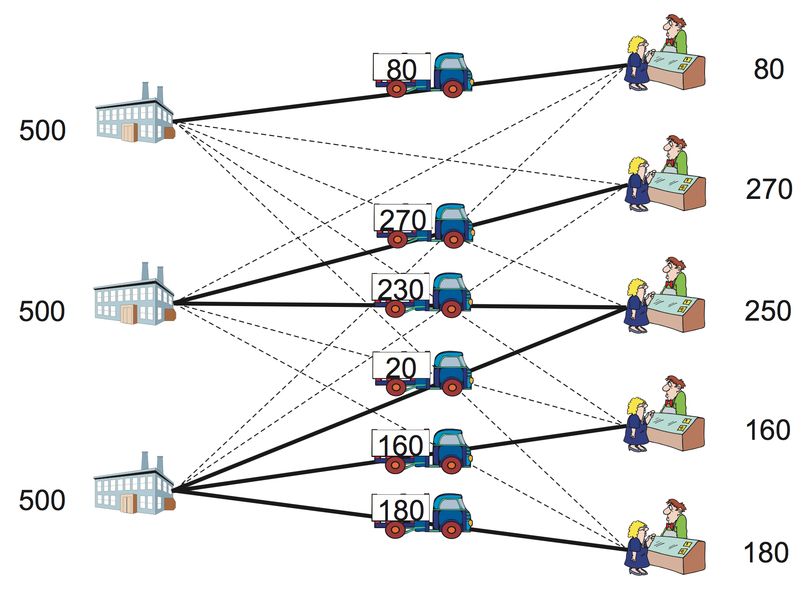
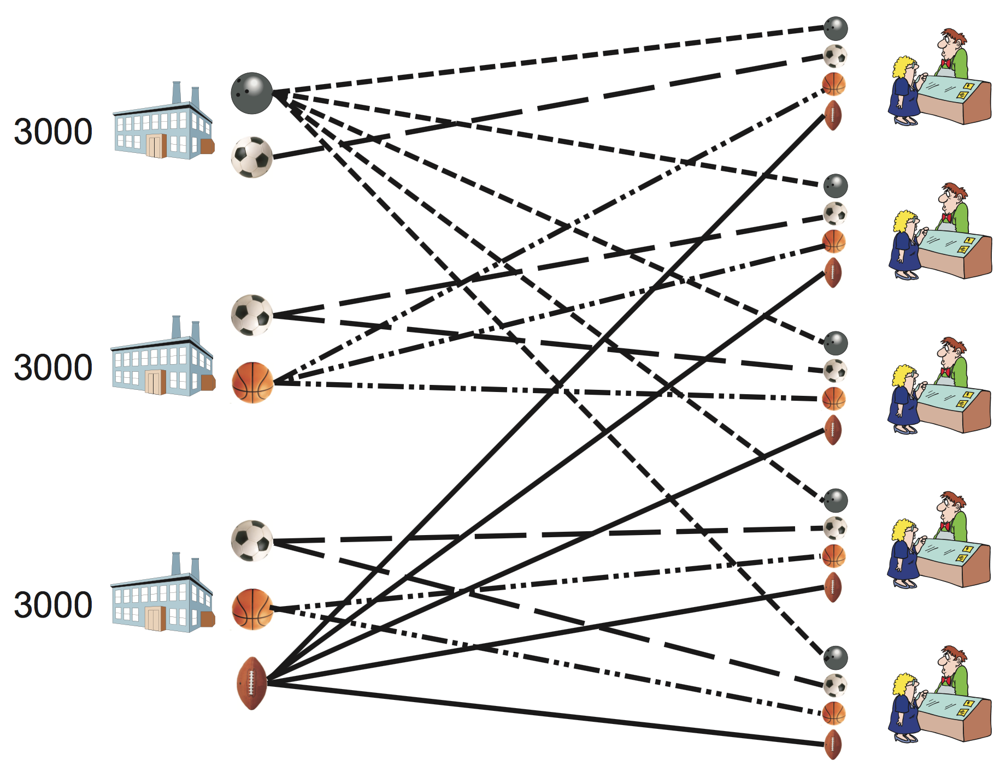

.. role:: py(code)
   :language: python

.. _intro:

.. pull-quote::

   Nothing in the world takes place without optimization, and there is no doubt that all aspects of the world that have a rational basis can be explained by optimization methods.  Leonhard Euler, 1744 (translation found in "Optimization Stories", edited by Martin Grötschel).

********************************************************************************
Introduction
********************************************************************************

.. todo
   duality: margin seminar
   knapsack and branch-and-bound: margin seminar

This introductory chapter is a run-up to Chapter 2 onwards.  It is an overview of mathematical optimization through some simple examples, presenting also the main characteristics of the solver used in this book: SCIP (http://scip.zib.de).

The rest of this chapter is organized as follows.
Section :ref:`matopt` introduces the basics of mathematical optimization and illustrates main ideas via a simple example.
Section :ref:`linopt` presents a real-world production problem to discuss concepts and definitions of linear-optimization model, showing details of SCIP/Python code for solving a production problem.
Section :ref:`intopt` introduces an integer optimization model by adding integer conditions to variables, taking as an example a simple puzzle sometimes used in junior high school examinations.
A simple transportation problem,  which is a special form of the linear optimization problem,  along with its solution is discussed in Section :ref:`transp`.  Here we show how to model an optimization problem as a function, using SCIP/Python.
Section :ref:`duality` explains duality, an important theoretical background of linear optimization, by taking a transportation problem as an example.
Section :ref:`mptransp` presents a multi-commodity transportation problem, which is an generalization of the transportation, and describes how to handle sparse data with SCIP/Python.
Section :ref:`blending` introduces mixture problems as an application example of linear optimization.
Section :ref:`fraction` presents the fraction optimization problem, showing two ways to reduce it to a linear problem.
Section :ref:`mkp` illustrates a knapsack problem with details of its solution procedure, including an explanation on how to debug a formulation.
Section :ref:`diet` considers how to cope with nutritional problems, showing an example of an optimization problem with no solution.

.. _matopt:

Mathematical Optimization
================================================================================   

Let us start by describing what mathematical optimization is: it is the science of finding the “best” solution based on a given objective function, i.e., finding a solution which is at least as good and any other possible solution.  In order to do this, we must start by describing the actual problem in terms of mathematical formulas; then, we will need a methodology to obtain an optimal solution from these formulas.  Usually, these formulas consist of constraints, describing conditions that must be satisfied, and by an objective function.

In other words, a mathematical optimization problem is usually expressed as:
   - *objective function* (which we want to maximize of minimize);
   - *conditions of the problem:* constraint 1, constraint 2, ...

.. index::
   single: formulation in mathematical optimization
   single: variables
   single: constraints
   single: objective function
   single: minimize
   single: maximize
   single: optimum
   single: optimal solution

For the solution obtained to be meaningful, this model must capture the objective of optimization accurately, along with all essential problem requirements and details.  The steps for building an algebraic model of a mathematical optimization consists of defining:
  1. a set of *variables*: the unknowns that need to be found as a solution to the problem;
  2. a set of *constraints*: equations or inequalities that represent requirements in the problem as relationships between the variables
  3. an *objective function*: an expression, in terms of the defined variables, which determines e.g. the total cost, or the profit of the targeted problem.

The problem is a minimization when smaller values of the objective are preferrable, as with costs; it is a maximization when larger values are better, as with profits.  The essence of the problem is the same, whether it is a minimization or a maximization (one can be converted into the other simply by putting a minus sign in the objective function).

In this text, the problem is described by the following format.

   - **Maximize** or **minimize**

     - Objective function
       
   - **Subject to:**

     - Constraint 1
     - Constraint 2
     - ...

The optimization problem seeks a solution to either *minimize* or *maximize* the objective function, while satisfying all the constraints.  Such a desirable solution is called *optimum* or *optimal solution*  --- the best possible from all candidate solutions measured by the value of the objective function.  The variables in the model are typically defined to be non-negative real numbers.

There are many kinds of mathematical optimization problems; the most basic and simple is *linear optimization*\ [#f1-intro]_\ .  In a linear optimization problem, the objective function and the constraints are all linear expressions (which are straight lines, when represented graphically).  If our variables are :math:`x_1, x_2, \ldots, x_n`, a linear expression has the form :math:`a_1 x_1 + a_2 x_2 + \ldots + ax_n`, where :math:`a_1, \ldots, a_n` are constants.

For example,

.. math::
     & \mbox{minimize }        & & 3 x     +  4 y \\
     & \mbox{subject to: }     & & 5 x     +  6 y  \geq  10 \\
     &                         & & 7 x     +  5 y  \geq  5  \\
     &                         & & x,           y  \geq  0

is a linear optimization problem.

One of the important features of linear optimization problems is that they are easy to solve.  Common texts on mathematical optimization describe in lengthy detail how a linear optimization problem can be solved.  Taking the extreme case, for most practitioners, how to solve a linear optimization problem is not important.  For details on how methods for solving these problems have emerged, see :ref:`Margin seminar 1 <seminar1>`.  Most of the software packages for mathematical optimization support linear optimization.  Given a description of the problem, an optimum solution (i.e., a solution that is guaranteed to be the best answer) to most of the practical problems can be obtained in an extremely short time.

Unfortunately, not all the problems that we find in the real world can be described as a linear optimization problem.  Simple linear expressions are not enough to accurately represent many complex conditions that occur in practice.  In general, optimization problems that do not fit in the linear optimization paradigm are called *nonlinear optimization* problems.

In practice, nonlinear optimization problems are often difficult to solve in a reliable manner.  Using the mathematical optimization solver covered in this document, SCIP, it is possible to efficiently handle some nonlinear functions; in particular, quadratic optimization (involving functions which are a polynomial of up to two, such as :math:`x^2 + xy`) is well supported, especially if they are convex.

.. index::
   single: integer optimization
   single: mixed-integer optimization

A different complication arises when some of the variables must take on integer values; in this situation, even if the expressions in the model are linear, the general case belongs to a class of difficult problems (technically, the NP-hard class [#f2-intro]_).  Such problems are called integer optimization problems; with ingenuity, it is possible to model a variety of practical situations under this paradigm.  The case where some of the variables are restricted to integer values, and other are continuous, is called a *mixed-integer* optimization problem.  Even for solvers that do not support nonlinear optimization, some techniques allow us to use mixed-integer optimization to approximate arbitrary nonlinear functions; these techniques (piecewise linear approximation) are described in detail in Chapter :ref:`piecewise`.

.. _linopt:

Linear Optimization
================================================================================   

.. index::
   single: variable; continuous variable; real variable
   single: constraint
   single: objective function
   single: optimum
   single: solution
   single: optimal solution
   single: linear optimization problem
   single: non-negativity constraint
   single: sign restriction

We begin with a simple linear optimization problem; the goal is to explain the terminology commonly used optimization.

.. math::

     & \mbox{maximize }        & 15 x_1  & {}+{} & 18 x_2 & {}+{} & 30 x_3  \\
     & \mbox{subject to: }     & 2  x_1  & {}+{} & x_2    & {}+{} &    x_3   & \leq & 60 \\
     &                         &    x_1  & {}+{} & 2 x_2  & {}+{} &    x_3   & \leq & 60 \\
     &                         &         &       &        &       &    x_3   & \leq & 30 \\
     &                         &    x_1, &       & x_2,   &       &    x_3   & \geq & 0

    
Let us start by explaining the meaning of :math:`x_1, x_2, x_3`: these are values that we do not know, and which can change continuously; hence, they are called *variables*.

The first expression defines the function to be maximized, which is called the *objective function*.

The second and subsequent expressions restrict the value of the variables  :math:`x1, x2, x3`, and are commonly referred to as *constraints*.  Expressions ensuring that the variables are non-negative :math:`(x1, x2, x3 \geq 0)` have the specific name of *sign restrictions* or *non-negativity constraints*.  As these variables can take any  non-negative real number, they are called *real variables*, or *continuous variables*.

In this problem, both the objective function and the constraint expressions consist of adding and subtracting the variables :math:`x_1, x_2, x_3` multiplied by a constant.  These are called *linear expressions*.  The problem of maximizing (or minimizing) a linear objective function subject to linear constraints is called a  *linear optimization problem*.

The set of values for variables :math:`x_1, x_2, x_3` is called a *solution*, and if it satisfies all constraints it is called a *feasible solution*.  Among feasible solutions, those that maximize (or minimize) the objective function are called *optimal solutions*.  The maximum (or minimum) value of the objective function is called the *optimum*.  In general, there are multiple solutions with an optimum objective value, but usually the aim is to find just one of them.

Finding such point can be explored in some methodical way; this is what a linear optimization solver does for finding the optimum.  Without delay, we are going to see how to solve this example using the SCIP solver.  SCIP has been developed at the Zuse Institute Berlin (ZIB), an interdisciplinary research institute for applied mathematics and computing.  SCIP solver can be called from several programming languages; for this book we have chosen the very high-level language *Python*.  For more information about SCIP and Python, see appendices :ref:`SCIPintro` and :ref:`PYTHONintro`, respectively.

The first thing to do is to read definitions contained in the SCIP module (a *module* is a different file containing programs written in Python).   The SCIP module is called ``pyscipopt``, and functionality defined there can be accessed with:

::

  from pyscipopt import Model

The instruction for using a module is ``import``.
In this statement we are importing the definitions of ``Model``.  We could also have used ``from pyscipopt import *``, where the asterisk means to import all the definitions available in ``pyscipopt``.
.. ; we have imported just some of them, and we could have used other idioms, as we will see later.
One of the features of Python is that, if the appropriate module is loaded, a program can do virtually anything [#f3-intro]_.

The next operation is to create an optimization model; this can be done with the ``Model`` class, which we have imported from the ``pyscipopt`` module.

::

    model = Model("Simple linear optimization")

With this instruction, we create an object named ``model``, belonging the class ``Model`` (more precisely, ``model`` is a *reference* to that object).  The model description is the (optional) string ``"Simple linear optimization"``, passed as an argument.

There is a number of actions that can be done with objects of type ``Model``, allowing us to add variables and constraints to the model before solving it.  We start defining variables :math:`x_1, x_2, x_3` (in the program, ``x1, x2, x3``).  We can generate a variable using the method ``addVar`` of the model object created above (a *method* is a function associated with objects of a class).  For example, to generate a variable ``x1`` we use the following statement:

::

    x1 = model.addVar(vtype="C", name="x1")

With this statement, the method ``addVar`` of class ``Model`` is called, creating a variable ``x1`` (to be precise, ``x1`` holds a reference to the variable object).  In Python, *arguments* are values passed to a function or method when calling it (each argument corresponds to a *parameter* that has been specified in the function definition).  Arguments to this method are specified within parenthesis after ``addVar``.  There are several ways to specify arguments in Python, but the clearest way is to write ``argument name = argument value`` as a *keyword argument*.   

Here, ``vtype = "C"`` indicates that this is a continuous variable, and ``name = "x1"`` indicates that its name (used, e.g., for printing) is the string ``"x1"``.  The complete signature (i.e., the set of parameters) for the ``addVar`` method is the following:

::

    addVar(name="", vtype="C", lb=0.0, ub=None, obj=0.0, pricedVar = False)

Arguments are, in order, the name, the type of variable, the lower bound, the upper bound, the coefficients in the objective function.  The last parameter, ``pricedVar`` is used for *column generation*, a method that will be explained in Chapter :ref:`bpp+csp`.  In Python, when calling a method omitting keyword arguments (which are optional) default values (given after ``=``) are applied.  In the case of ``addVar``, all the parameters are optional.  This means that if we add a variable with ``model.addVar()``, SCIP will create a continuous, non-negative and unbounded variable, whose name is an empty string, with coefficient 0 in the objective (``obj=0``).  The default value for the lower bound is specified with ``lb=0.0``, and the upper bound ``ub`` is implicitly assigned the value infinity (in Python, the constant ``None`` usually means the absence of a value).  When calling a function or method, keyword arguments without a default value cannot be omitted.

Functions and methods may also be called by writing the arguments without their name, in a predetermined order, as in:

::

    x1 = model.addVar("x1", "C", 0, None, 15)

Other variables may be generated similarly.  Note that the third constraint :math:`x 3 \leq 30` is the upper bound constraint of variable :math:`x_3`, so we may write ``ub = 30`` when declaring the variable.

    
.. index::
   single: linear expression

Next, we will see how to enter a constraint.  For specifying a constraint, we will need to create a *linear expression*, i.e., an expression in the form of :math:`c_1 x_1 + c_2 x2 + \ldots + c_n x_n`, where each :math:`c_i` is a constant and each :math:`x_i` is a variable. We can specify a linear constraint through a relation between two linear expressions.  In SCIP’s Python interface, the constraint :math:`2x1 + x2 + x3 \leq 60` is entered by using method ``addConstr`` as follows:

::

    model.addConstr(2*x1 + x2 + x3 <= 60)

The signature for ``addConstr`` (ignoring some parameters which are not of interest now) is:

::

    addConstr(relation, name="", ...)

.. index::
   single: left-hand side
   single: right-hand side
   single: lhs
   single: rhs

SCIP supports more general cases, but for the time being let us concentrate on linear constraints.  In this case, parameter ``relation`` is a linear constraint, including a *left-hand side* (lhs), a *right-hand side* (rhs), and the sense of the constraint. Both *lhs* and *rhs* may be constants, variables, or linear expressions; *sense* maybe ``"<="`` for less than or equal to, ``">="`` for greater than or equal to, or ``"=="`` for equality. The name of the constraint is optional, the default being an empty string. Linear constraints may be specified in several ways; for example, the previous constraint could be written equivalently as:

::

    model.addConstr(60 >= 2*x1 + x2 + x3)

Before solving the model, we must specify the objective using the ``setObjective`` method, as in:

::

    model.setObjective(15*x1 + 18*x2 + 30*x3, "maximize")

.. index::
   single: objective
   single: maximize
   single: minimize
   single: model sense

The signature for ``setObjective`` is:

::

    setObjective(expression, sense="minimize", clear="true"):
   
The first argument of ``setObjective`` is a linear (or more general) expression, and the second argument specifies the direction of the objective function with strings ``"minimize"`` (the default) or ``"maximize"``.  (The third parameter, ``clear``, if ``"true"`` indicates that coefficients for all other variables should be set to zero.)  We may also set the direction of optimization using ``model.setMinimize()`` or ``model.setMaximize()``.

At this point, we can solve the problem using the method ``optimize`` of the ``model`` object:

::

    model.optimize()

After executing this statement --- if the problem is feasible and bounded, thus allowing completion of the solution process ---, we can output the optimal value of each variable. This can be done through method ``getVal`` of ``Model`` objects; e.g.:

::

    print(model.getVal(x1))

The complete program for solving our model can be stated as follows:

.. literalinclude:: ../STRIPPED/lo_simple.py
   :linenos:

If we execute this Python program, the output will be:

.. code-block:: none
   :linenos:

   [solver progress output omitted]
   Optimal value: 1230.0
   Solution:
     x1 =  10.0
     x2 =  10.0
     x3 =  30.0

The first lines, not shown, report progress of the SCIP solver (this can be suppressed) while lines 2 to 6 correspond to the output instructions of lines 14 to 16 of the previous program.

.. _seminar1:

.. NOTE::

   **Margin seminar 1**

   *Linear programming*

   Linear programming was proposed by George Dantzig in 1947, based on the work of three Nobel laureate economists: Wassily Leontief, Leonid Kantrovich, Tjalling Koopmans.  At that time, the term used was "optimization in linear structure", but it was renamed as "linear programming" in 1948, and this is the name commonly used afterwards.  The simplex method developed by Dantzig has long been the almost unique algorithm for linear optimization problems, but it was pointed out that there are (mostly theoretical) cases where the method requires a very long time.

   The question as to whether linear optimization problems can be solved efficiently in the theoretical sense (in other words, whether there is an algorithm which solves linear optimization problems in polynomial time) has been answered when the ellipsoid method was proposed by Leonid Khachiyan (Khachian), of the former Soviet Union, in 1979.  Nevertheless, the algorithm of Khachiyan was only theoretical, and in practice the supremacy of the simplex method was unshaken.  However, the interior point method proposed by Narendra Karmarkar in 1984 [#f6-intro]_ has been proved to be theoretically efficient, and in practice it was found that its performance can be similar or higher than the simplex method's.  Currently available optimization solvers are usually equipped with both the simplex method (and its dual version, the *dual simplex method*) and with interior point methods, and are designed so that users can choose the most appropriate of them.
.. how is it in Python/SCIP?

   
.. _intopt:

Integer Optimization
================================================================================   

.. index::
   single: integer optimization
   single: formulation

For many real-world optimization problems, sometimes it is necessary to obtain solutions composed of integers instead of real numbers. For instance, there are many puzzles like this: *“In a farm having chicken and rabbits, there are 5 heads and 16 feet. How many chicken and rabbits are there?”*  Answer to this puzzle is meaningful if the solution has integer values only.

Let us consider a concrete puzzle.

.. case study
.. container::

   Adding the number of heads of cranes, turtles and octopuses totals 32, and the number of legs sums to 80.  What is the minimum number of turtles and octopuses?

Let us formalize this as an optimization problem with mathematical formulas.  This process of describing a situation algebraically is called the *formulation* of a problem in mathematical optimization.

Then, the number of heads can be expressed as :math:`x + y + z`. Cranes have two legs each, turtles have four legs each, and each octopus has eight legs.  Therefore, the number of legs can be expressed as :math:`2x + 4y + 8z`.  So the set of :math:`x, y, z` must satisfy the following "constraints":

.. math::

     & \mbox{subject to: }     &    x    & {}+{} &    y   & {}+{} &    z     & \; = \; & 32 \\
     &                         &  2 x    & {}+{} &  4 y   & {}+{} &  8 z     & \; = \; & 80 \\

Since there are three variables and only two equations, there may be more than one solution.  
Therefore, we add a condition to minimize the sum :math:`y + z` of the number of turtles and octopuses.
This is the "objective function".  We obtain the complete model after adding the non-negativity constraints.

.. math::

     & \mbox{minimize }        &         &       &    y   & {}+{} &    z     \\
     & \mbox{subject to: }     &    x    & {}+{} &    y   & {}+{} &    z     & \; = \; & 32 \\
     &                         &  2 x    & {}+{} &  4 y   & {}+{} &  8 z     & \; = \; & 80 \\
     &                         &    x,   &       &    y,  &       &    z     & \; \geq \; & 0

When we use a linear optimization solver, we obtain the solution :math:`x = 29.3333, y = 0, z = 2.66667`. This is obviously a strange answer.  Cranes, tortoises and octopuses can be divided when they are lined up as food on the shelves, but not when they are alive. To solve this model, we need to add conditions to force the variables to have integer values.  These are called *integrality constraints*: :math:`x, y, z` must be non-negative integers. Linear optimization problems with conditions requiring variables to be integers are called *integer optimization problems*. For the puzzle we are solving, thus, the correct model is:

.. math::

     & \mbox{minimize }        &         &       &    y   & {}+{} &    z  \\
     & \mbox{subject to: }     &    x    & {}+{} &    y   & {}+{} &    z  & \; = \; & 32 \\
     &                         &  2 x    & {}+{} &  4 y   & {}+{} &  8 z  & \; = \; & 80 \\
     &                         &    x,   &       &    y,  &       &    z  & \; \geq \;  &  0, \mbox{integer}

Below is a simple Python/SCIP program for solving it. The main difference with respect to the programs that we have seen before concerns the declaration of variables; in this case, there is an argument to ``addVar`` for specifying that variables are integer: ``vtype="I"``. Continuous variables (the default) can be explicitly declared with ``vtype="C"``, and binary variables --- a special case of integers, restricted to the values 0 or 1 --- are declared with ``vtype="B"``.

.. literalinclude:: ../STRIPPED/puzzle.py
   :linenos:

For small integer optimization problems like this, the answer can be quickly found: :math:`x=28`, :math:`y=2`, and :math:`z=2`, meaning that there are 28 cranes, 2 turtles and 2 octopuses.  Notice that this solution is completely different of the continuous version's; in general, we cannot guess the value of an integer solution from the continuous model.  In general, integer-optimization problems are much harder to solve when compared to linear-optimization problems.

[`source code <PROGS/puzzle.py>`_]

.. _transp:

Transportation Problem
================================================================================   

.. index::
   single: transportation problem

The next example is a classical linear optimization problem called the *transportation problem*.
Consider the following scenario.

.. case study
.. container::

   You are the owner of a sports equipment sales chain.  Your products are manufactured at three factories, and you have to deliver them to five customers (demand points) (Figure :ref:`ftransp`).  After elaborating a survey, you found that the production capacity at each factory, the transportation cost to customers, and the demand amount at each customer are as shown in Table :ref:`ttransp`.  So, which of the transport routes would you choose to minimize the total cost?

.. _ftransp:

 
   Transportation problem
 
   Graph representation of a transportation problem and its optimal transport volume.
   
    
.. _ttransp:
 
.. table:: Data for the transportation problem
 
   +----------------------+--+------------+----------+----------+----------+----------+----------------------+
   |                      |  |                      Customers :math:`i`               |                      |
   +----------------------+--+------------+----------+----------+----------+----------+----------------------+
   | Transportation       |  |            |          |          |          |          |                      |
   | cost :math:`c_{ij}`  |  |      1     |    2     |    3     |    4     |    5     | capacity :math:`M_j` |
   +======================+==+============+==========+==========+==========+==========+======================+
   |                      | 1| 4          | 5        | 6        | 8        | 10       | 500                  |
   +                      +--+------------+----------+----------+----------+----------+----------------------+
   |                      | 2| 6          | 4        | 3        | 5        |  8       | 500                  |
   + plant :math:`j`      +--+------------+----------+----------+----------+----------+----------------------+
   |                      | 3| 9          | 7        | 4        | 2        |  4       | 500                  |
   +----------------------+--+------------+----------+----------+----------+----------+----------------------+
   | demand :math:`d_i`   |  |  80        | 270      | 250      | 160      | 180      |                      |
   +----------------------+--+------------+----------+----------+----------+----------+----------------------+

Table :ref:`ttransp` shows customer demand volumes, shipping costs from each factory to each customer, and production capacity at each factory.  More precisely, :math:`d_i` is the demand of customer :math:`i`, where :math:`i =` 1 to 4. Each plant :math:`j` can supply its customers with goods but their production capacities are limited by :math:`M_j`, where :math:`j =` 1 to 3. Transportation cost for shipping goods from plant :math:`i` to customer :math:`j` is given in the table by :math:`c_{ij}`.

Let us formulate the above problem as a linear optimization model.  Suppose that the number of customers is :math:`n` and the number of factories is :math:`m`. Each customer is represented by :math:`i = 1, 2, \ldots, n`, and each factory by :math:`j = 1, 2, \ldots, m`.  Also, let the set of customers be :math:`I = {1, 2, \ldots, n}` and the set of factories :math:`J = {1, 2, \ldots, m}`.  Suppose that the demand amount of customer :math:`i` is :math:`d_i`, the transportation cost for shipping one unit of demand from plant :math:`i` to customer :math:`j` is :math:`c_{ij}`, and that each plant :math:`j` can supply its customers with goods, but their production capacities are limited by :math:`M_j`

We use continuous variables as defined below.

.. math::
    x_{ij} = \text{ amount of goods to be transported from factory $j$ to customer $i$}

Using the above symbols and variables, the transport problem can be formulated as the following linear optimization problem.

.. math::
    &\mbox{ minimize }     & \quad \sum_{i \in I} \sum_{j \in J} c_{ij} x_{ij}  &     \\
    &\mbox{ subject to   } & \quad \sum_{j \in J} x_{ij} =d_i                 & \quad \forall  i \in I  \\
    &                      & \quad \sum_{i \in I} x_{ij} \leq M_j             & \quad \forall  j \in J  \\   
    &                      & \quad x_{ij} \geq 0                            & \quad \forall  i \in I, j \in J

The objective function is the minimization of the sum of transportation expenses.  The first constraint requires that the demand is satisfied, and the second constraint ensures that factory capacities are not exceeded.

.. index::
   single: dictionary
   single: multidict

Let us solve this with Python/SCIP.  First, we prepare the data needed for describing an instance [#f7-instance]_.  In the transportation problem, it is necessary to prepare data defining demand amount :math:`d_i`, transportation costs :math:`c_{ij}`, capacities :math:`M_j`.  In the following program, we will use the same symbol used in the formulation for holding a Python's dictionary.  A dictionary is composed of a key and a value as its mapping, and is generated by arranging pais of keys and values in brackets, separated by commas: ``{key1:value1, key2:value2, ...}``.  (For details on dictionaries see :ref:`appendix A.2.5`).

The demand amount :math:`d_i` is stored in a dictionary ``d`` with the customer's number as the key and the demand amount as the value, and the capacity :math:`M_j` is stored in the dictionary ``M`` with the factory number as the key and the capacity as the value.

.. code-block:: python
                
    d = {1:80 , 2:270 , 3:250 , 4:160 , 5:180}
    M = {1:500 , 2:500 , 3:500}

In addition, a list ``I`` of customers' numbers and a list ``J`` of factory numbers can be prepared as follows.

.. code-block:: python

    I = [1,2,3,4]
    J = [1,2,3]   

Actually, the dictionaries and lists above can be created at once by using the ``multidict`` function available in Python/SCIP, as follows.

.. code-block:: python

    I, d = multidict({1:80, 2:270, 3:250, 4:160, 5:180})
    J, M = multidict({1:500, 2:500, 3:500})

When the dictionary is entered as an argument, the ``multidict`` function returns a pair of values; the first is the list of keys, and the second value is the dictionary sent as argument.  Later, we will see that this function is very useful when we want to associate more than one value to each key.  (For a more detailed usage of ``multidict``, see :ref:`appendix B.4`.)

.. index::
   single: tuple

Shipping cost :math:`c_{ij}` has two subscripts.  This is represented in Python by a dictionary ``c`` with a tuple of subscripts (customer and factory) as keys, and the corresponding costs as values.  A tuple is a sequence, like a list; however, unlike a list, its contents can not be changed: a tuple is *immutable*.  Tuples are created using parentheses and, due to the fact that they are immutable, can be used as keys of a dictionary (see :ref:`appendix A.2.4` for details on tuples).

.. code-block:: python

    c = {(1,1):4,    (1,2):6,    (1,3):9,
         (2,1):5,    (2,2):4,    (2,3):7,
         (3,1):6,    (3,2):3,    (3,3):3,
         (4,1):8,    (4,2):5,    (4,3):3,
         (5,1):10,   (5,2):8,    (5,3):4,
         }

With this dictionary ``c``, the transportation cost from factory :math:`j` to customer :math:`i` can be accessed with ``c[(i,j)]`` or ``c[i,j]`` (in a tuple, we can omit parenthesis).

.. attention::
   As a programming habit, it is preferable not to use a one-letter variables such as ``d, M, c`` above.  We have done it so that the same symbols are used in the formulation and in the program.  However, in larger programs it is recommended to use meaningful variables names, such as ``demand, capacity, cost``.

Let us write a program to solve the instance specified above.

.. code-block:: python
   :linenos:

   model = Model("transportation")
   x = {}
   for i in I:
       for j in J:
           x[i,j] = model.addVar(vtype="C", name="x(%s,%s)" % (i,j))

First, we define a Python variable ``x``, which initially contains an empty dictionary (line 2).   We then use dictionary ``x`` to store variable's objects, each of them corresponding to an :math:`x_{ij}` of our model (lines 3 to 5).　　As ``I`` is a list of customers' indices, the ``for`` cycle of line 3 iterates over all customers :math:`i`.
Likewise, since ``J`` is a list of factory indices, the ``for`` cycle of line 4 iterates over the quantity transported from factory :math:`j` to customer :math:`i` (see :ref:`appendix A.4.2` for more information about iteration).
In the rightmost part of line 5 the variable is named ``x(i,j)``; this uses Python's string format operation ``%``, where ``%s`` represents substitution into a character string.

.. index::
   single: generator
   single: list comprehension
   single: quicksum
   single: sum

Next we add constraints.  First, we add the constraint

.. math::
    \sum_{j \in J} x_{ij} = d_i & \quad \forall  i \in I\\

which imposes that the demand is satisfied.  Since this is a constraint for all customers :math:`i`, a constraint :math:`\sum_{j=1}^m x_{ij} = d_i` is added by the ``addCons`` method (line 2) at each iteration of the ``for`` cycle of line 1.

.. code-block:: python
   :linenos:

   for i in I:
       model.addCons(quicksum(x[i,j] for j in J if (i,j) in x) == d[i], name="Demand(%s)" % i)

Notice that here we also give a name, ``Demand(i)``, to constraints.  Although, as for variables, the name of a constraint may be omitted, it is desirable to add an appropriate name for later reference. The ``quicksum`` function on the second line is an enhanced version of the ``sum`` function available in Python, used in Python/SCIP to do the computation of linear expressions more efficiently. It is possible to provide ``quicksum`` explicitly with a list, or with a list generated by iteration with a ``for`` statement, as we did here; these *generator* work in the same way as in list comprehensions in Python (see :ref:`appendix A.4.2`). In the above example, we calculate a linear expression by summing variables :math:`x_{ij}` for element :math:`j \in J` by means of ``quicksum(x[i,j] for j in J)``.  (For a more detailed explanation of ``quicksum``, see :ref:`appendix B.4`.)

Similarly, we add the factory capacity constraint

.. math::
    & \quad \sum_{i \in I} x_{ij} \leq M_j & \quad \forall  j \in J\\

to the model as follows:

.. code-block:: python
   :linenos:

   for j in J:
       model.addCons(quicksum(x[i,j] for i in I if (i,j) in x) <= M[j], name="Capacity(%s)" % j)

Again, we give a name ``Capacity(j)`` to each constraint.  In the following, to simplify the description, names of constraints are often omitted; but in fact it is safer to give an appropriate name.

The objective function

.. math::
    \mbox{ minimize }     & \quad \sum_{i \in I} \sum_{j \in J} c_{ij} x_{ij}  &     \\

is set using the ``setObjective`` method, as follows.

.. code-block:: python
   :linenos:

   model.setObjective(quicksum(c[i,j]*x[i,j]  for (i,j) in x), "minimize")

Finally, we can optimize the model and display the result.

.. code-block:: python
   :linenos:

   model.optimize()
   print("Optimal value:", model.getObjVal())
   EPS = 1.e-6
   for (i,j) in x:
       if model.getVal(x[i,j]) > EPS:
           print("sending quantity %10s from factory %3s to customer %3s" % (model.getVal(x[i,j]),j,i))

In this code, ``for (i,j) in x`` in line 4 is an iteration over dictionary ``x``, holding our model's variable.  This iteration goes through all the tuples :math:`(i,j)` of customers and factories which are keys of the dictionary. Line 5 is a conditional statement for outputting only non-zero variables. Line 6 uses Python's string formatting operator ``%``, where ``%10s`` is converted into a 10-digit character string and ``%3s`` is converted into a 3-digit character string.

When the above program is executed, the following result is obtained.
The results are shown in Table :ref:`rtransp` and Figure :ref:`ftransp`.

.. code-block:: none
   :linenos:

   [solver progress output omitted]
   SCIP Status        : problem is solved [optimal solution found]
   Solving Time (sec) : 0.00
   Solving Nodes      : 1
   Primal Bound       : +3.35000000000000e+03 (1 solutions)
   Dual Bound         : +3.35000000000000e+03
   Gap                : 0.00 %
   Optimal value: 3350.0
   sending quantity      230.0 from factory   2 to customer   3
   sending quantity       20.0 from factory   3 to customer   3
   sending quantity      160.0 from factory   3 to customer   4
   sending quantity      270.0 from factory   2 to customer   2
   sending quantity       80.0 from factory   1 to customer   1
   sending quantity      180.0 from factory   3 to customer   5

.. _rtransp:
 
.. table:: Optimal solution for the transportation problem
 
   +----------------------+------------+----------+----------+----------+----------+-------+----------+
   | Customer :math:`i`   |      1     |    2     |    3     |    4     |    5     |       |          |
   +----------------------+------------+----------+----------+----------+----------+-------+----------+
   | Amount demanded      |     80     |  270     |  250     |  160     |  180     |       |          |
   +----------------------+------------+----------+----------+----------+----------+-------+----------+
   | Plant :math:`j`      |     Optimum volume transported                         | total | capacity |
   +======================+============+==========+==========+==========+==========+=======+==========+
   |          1           | 80         |          |          |          |          | 80    | 500      |
   +----------------------+------------+----------+----------+----------+----------+-------+----------+
   |          2           |            | 270      | 230      |          |          | 500   | 500      |
   +----------------------+------------+----------+----------+----------+----------+-------+----------+
   |          3           |            |          |  20      | 160      | 180      | 360   | 500      |
   +----------------------+------------+----------+----------+----------+----------+-------+----------+

[`source code <src/transp_nofn.py>`_]

.. _duality:

Duality
================================================================================   

.. index::
   single: duality
   single: primal
   single: dual
   single: sensitivity analysis

Consider the following scenario.

.. case study
.. container::

   You are the owner of the sports equipment sales chain that appeared on Section :ref:`transp`.  You feel that factory's capacity has become tight, so you are considering an expansion.  What kind of expenses can be expected to be reduced by expanding each of the factories?  Also, what is the additional gain that you can you get if you have additional orders from each customer?
   
......

Let us re-visit the wine production problem considered earlier to discuss some important concepts in linear-optimization models that play vital role in *sensitivity analysis*. Sensitivity analysis is important for finding out how optimal solution and optimal value may change when there is any change to the data used in the model. Since data may not always be considered as totally accurate, such analysis can be very helpful to the decision makers.

Let us assume that an entrepreneur is interested in the wine making company and would like to buy its resources. The entrepreneur then needs to find out how much to pay for each unit of each of the resources, the pure-grape wines of 2010 A, B and C. This can be done by solving the *dual* version of the model that we will discuss next.

Let :math:`y_1 , y_2` and :math:`y_3` be the price paid, per barrel of Alfrocheiro, Baga, and Castelão, respectively. Then, the total price that should be paid is the quantities of each of the wines in inventory times their prices, i.e., :math:`60y_1 + 60y_2 + 30y_3`. Since the entrepreneur would like the purchasing cost to be minimum, this is the objective function for minimization. Now, for each of the resources, constraints in the model must ensure that prices are high enough for the company to sell to the entrepreneur. For instance, with two barrels of A and one barrel of B, the company can prepare blend :math:`D` worth 15; hence, it must be offered :math:`2y_1 + y_2 \ge 15`. Similarly we obtain :math:`y_1 + 2y_2 \ge 18` and :math:`y_1 + y_2 + y_3 \ge 30` for the blends M and S, respectively. Thus we can formulate a dual model, stated as follows (for a more sound derivation, using Lagrange multipliers, see :ref:`lagrange`).

.. _wines_dual:

.. table:: Dual of the wine blending problem.

    =============     ==============    ========    ==========   ===============
    \                 A Alfrocheiro     B Baga      C Castelão   *worth*
    =============     ==============    ========    ==========   ===============
    D Dry             2                 1           0            15   
    M Medium          1                 2           0            18   
    S Sweet           1                 1           1            30   
    *inventory*       60                60          20            
    =============     ==============    ========    ==========   ===============

.. math::

     & \mbox{minimize }        & 60 y_1  & {}+{} & 60 y_2 & {}+{} & 30 y_3               \\ 
     & \mbox{subject to: }     & 2  y_1  & {}+{} &    y_2 &       &          & \geq & 15 \\ 
     &                         &    y_1  & {}+{} &  2 y_2 &       &          & \geq & 18 \\ 
     &                         &    y_1  & {}+{} &    y_2 & {}+{} &    y_3   & \geq & 30 \\ 
     &                         &    y_1, &       &    y_2,&       &    y_3   & \geq & 0  

The variables used in the linear-optimization model of the production problem are called *primal variables* and their solution values directly solve the optimization problem. The linear-optimization model in this setting is called the *primal model*.

As seen above, associated with every primal model, there is a dual model. The relationships between primal and dual problems can provide significant information regarding the quality of solutions found and sensitivity of the coefficients used. Moreover, they also provide vital economic interpretations. For example, :math:`y_1`, the price paid for one unit of Alfrocheiro pure-grape wine is called the *shadow price* of that resource, because it is the amount by which the optimal value of the primal model will change for a unit increase in its availability --- or, equivalently, the price the company would be willing to pay for an additional unit of that resource.

Gurobi allows us to access the shadow prices (i.e., the optimal values of the dual variables associated with each constraint) by means of the ``.Pi`` attribute of the constraint class; e.g., in the model for the wine production company of program :ref:`wblending` we are printing these values in line 31.

.. index::
   single: reduced cost
   single: opportunity cost
   single: sensitivity analysis

Another concept important in duality is the *reduced cost*, which is associated with each decision variable. It is defined as the change in objective function value if one unit of some product that is normally not produced is forced into production; it can also be seen as the amount that the coefficient in the objective has to improve, for a variable that is zero in the optimal solution to become non-zero. Therefore, reduced cost is also appropriately called *opportunity cost*. Shadow prices and reduced costs allow *sensitivity analysis* in linear-optimization and help determine how sensitive the solutions are to small changes in the data. Such analysis can tell us how the solution will change if the objective function coefficients change or if the resource availability changes. It can also tell us how the solution may change if a new constraint is brought into the model. Gurobi allows us accessing the reduced costs through the ``.RC`` attribute of the variable class; e.g., ``x.RC`` is the reduced cost of variable ``x`` in the optimal solution.

As we will see later, primal and dual models can be effectively used not only to gain insights into the solution but also to find a bound for the *linear-optimization relaxation* of an integer-optimization model; linear-optimization relaxation is obtained by having the integrality constraints relaxed to non-integer solution values. Typically, an integer-optimization model is much harder to solve than its linear-optimization relaxation. Specialized algorithms have been designed around the relaxation versions of primal as well as dual optimization models for finding optimal solution more efficiently. Optimal solution of a relaxation model gives a bound for the optimal solution value of the underlying integer-optimization model, and that can be exploited in a *branch-and-bound* scheme for solving the integer optimization model.

[`source code <PROGS/lo_wines.py>`_]

.. _mptransp:

Multi-product Transportation Problem
================================================================================   

In the previous transportation problem, we considered only one kind of goods produced at the production plants. In the real-world, however, that is a very restrictive scenario: A producer typically produces many different kinds of products and the customers typically demand different sets of the products available from the producers. Moreover, some producers may be specialized into producing only certain kinds of products while some others may only supply to certain customers. Therefore, a general instance of the transportation problem needs to be less restrictive and account for many such possibilities.

   Multicommodity transportation

   Graph representation for a multicommodity transportation problem.  Suppliers are represented as squares and clients as circles; thick lines represent arcs actually used for transportation in a possible solution, and colors in arcs mean different products.

A more general version of the transportation problem is typically studied as a multi-commodity transportation model. A linear-optimization model can be built using decision variables :math:`x_{ijk}` where :math:`i` denotes the customer, :math:`j` denotes the production plant and :math:`k` denotes the product type. Customer demand is indexed by :math:`i` and :math:`k` to denote the customer and product type. Then the model can be stated as follows.

.. math::
    & \mbox{ minimize }    & \sum_{i=1}^n \sum_{j=1}^m \sum_{k=1}^K c_{ijk} x_{ijk}  &     \\
    & \mbox{ subject to }  & \sum_{j=1}^m x_{ijk} =d_{ik} &  \mbox{ for }  i=1,\cdots,n, k =1,\cdots,K  \\
    &                      & \sum_{i=1}^n \sum_{k=1}^K x_{ijk} \leq M_j &  \mbox{ for }  j=1,\cdots,m  \\   
    &                      & x_{ijk} \geq 0 & \mbox{ for }  i=1,\cdots,n, j=1,\cdots,m, k=1,\cdots,K  

Note that the objective function addresses the minimum total cost for all possible cost combinations involving customers, production plants and product types. The first set of constraints ensure that all demands of the product types from the customers are met exactly while the second set of constraints ensure that capacity at each production plant is not exceeded by taking into account all product types and all customers.

A model for this in Python/Gurobi can be written as follows:

.. code-block:: python
   :linenos:

    def mctransp(I, J, K, c, d, M):
        model = Model("multi-commodity transportation")
        x = {}
        for i,j,k in c:
            x[i,j,k] = model.addVar(vtype="C", name="x[%s,%s,%s]" % (i, j, k))
        model.update()
        for i in I:
            for k in K:
                model.addConstr(quicksum(x[i,j,k] for j in J if (i,j,k) in x) == d[i,k], "Demand[%s,%s]" % (i,k))
        for j in J:
            model.addConstr(quicksum(x[i,j,k] for (i,j2,k) in x if j2 == j) <= M[j], "Capacity[%s]" % j)
        model.setObjective(quicksum(c[i,j,k]*x[i,j,k]  for i,j,k in x), GRB.MINIMIZE)
        model.update()
        model.__data = x
        return model

Variables are created in line 5. In lines 9 and 10 we create a list the variables that appear in each demand-satisfaction constraint, and the corresponding coefficients; these are then used for creating a linear expression, which is used as the left-hand side of a constraint in line 11. Capacity constraints are created in a similar way, in lines 13 to 15. For an example, consider now the same three production plants and five customers as before. Plant 1 produces two products, football and volleyball; it can supply football only to Customer 1 and volleyball to all five customers. Plant 2 produces football and basketball; it can supply football to Customers 2 and 3, basketball to Customers 1, 2 and 3. Plant 3 produces football, basketball and rugby ball; it can supply football and basketball to Customers 4 and 5, rugby ball to all five customers.

Let us specify the data for this problem in a Python program. First of all, we must state what products each of the plants can manufacture; on dictionary ``produce`` the key is the plant, to which we are associating a list of compatible products. We also create a dictionary ``M`` with the capacity of each plant (3000 units, in this instance).

.. code-block:: python

    J,M = multidict({1:3000, 2:3000, 3:3000})
    produce = {1:[2,4], 2:[1,2,3], 3:[2,3,4]}

The demand for each of the customers can be written as a double dictionary: for each customer, we associate a dictionary of products and quantities demanded.

.. code-block:: python

    d = {(1,1):80,   (1,2):85,   (1,3):300,  (1,4):6,
         (2,1):270,  (2,2):160,  (2,3):400,  (2,4):7,
         (3,1):250,  (3,2):130,  (3,3):350,  (3,4):4,
         (4,1):160,  (4,2):60,   (4,3):200,  (4,4):3,
         (5,1):180,  (5,2):40,   (5,3):150,  (5,4):5
         }
    I = set([i for (i,k) in d])
    K = set([k for (i,k) in d])

For determining the transportation cost, we may specify the unit weight for each product and the transportation cost per unit of weight; then, we calculate :math:`c_{ijk}` as their product:

.. code-block:: python

    weight = {1:5, 2:2, 3:3, 4:4}
    cost = {(1,1):4,  (1,2):6, (1,3):9,
            (2,1):5,  (2,2):4, (2,3):7,
            (3,1):6,  (3,2):3, (3,3):4,
            (4,1):8,  (4,2):5, (4,3):3,
            (5,1):10, (5,2):8, (5,3):4
            }
    c = {}
    for i in I:
        for j in J:
            for k in produce[j]:
                c[i, j, k] = cost[i,j] * weight[k]

We are now ready to construct a model using this data, and solving it:

.. code-block:: python

    model = mctransp(c,d,M)
    model.optimize()
    print "Optimal value:", model.ObjVal
    EPS = 1.e-6
    x = model.__data
    for i,j,k in x:
        if x[i,j,k].X > EPS:
            print "sending %10g units of %3d from plant %3d to customer %3d" % (x[i,j,k].X, k, j, i)

If we execute this Python program, the output is the following:

.. code-block:: none
   :linenos:

    Optimize a model with 18 rows, 40 columns and 70 nonzeros
    Presolve removed 18 rows and 40 columns
    Presolve time: 0.00s
    Presolve: All rows and columns removed
    Iteration    Objective       Primal Inf.    Dual Inf.      Time
           0    1.7400000e+04   0.000000e+00   0.000000e+00      0s
     
    Solved in 0 iterations and 0.00 seconds
    Optimal objective  1.740000000e+04
    Optimal value: 17400.0
    sending      100.0 units of   2 from plant   3 to customer   4
    sending      210.0 units of   3 from plant   3 to customer   3
    sending       40.0 units of   3 from plant   2 to customer   3
    sending       40.0 units of   1 from plant   2 to customer   1
    sending       10.0 units of   3 from plant   2 to customer   1
    sending      100.0 units of   2 from plant   1 to customer   2
    sending      100.0 units of   3 from plant   2 to customer   2
    sending       70.0 units of   1 from plant   2 to customer   2
    sending       60.0 units of   1 from plant   2 to customer   4
    sending       30.0 units of   2 from plant   1 to customer   1
    sending      180.0 units of   1 from plant   2 to customer   5

Readers may have noticed by now that for these two transportation problems, even though we have used linear-optimization models to solve them, the optimal solutions are integer-valued --- as if we have solved integer-optimization models instead. This is because of the special structures of the constraints in the transportation problems that allow this property, commonly referred to as *unimodularity*. This property has enormous significance because, for many integer-optimization problems that can be modeled as transportation problems, we only need to solve their linear-optimization relaxations.

[`source code <PROGS/mctransp.py>`_]

.. _blending:

Blending problem
================================================================================   

.. _fraction:

Fraction optimization problem
================================================================================   

.. _mkp:

Multi-Constrained Knapsack Problem
================================================================================   

Knapsack problems are specially structured optimization problems. The general notion of the *knapsack problem* is to fill up a knapsack of certain capacity with items from a given set such that the collection has maximum value with respect to some special attribute of the items. For instance, given a knapsack of certain volume and several items of different weights, the problem can be that of taking the heaviest collection of the items in the knapsack. Based on weights, the knapsack can then be appropriately filled by a collection that is optimal in the context of weight as the special attribute.

Suppose we have a knapsack of volume 10,000 cubic-cm that can carry up to 7 Kg weight. We have four items having weights 2, 3, 4 and 5, respectively, and volume 3000, 3500, 5100 and 7200, respectively. Associated with each of the items is its value of 16, 19, 23 and 28, respectively. We would like to fill the knapsack with items such that the total value is maximum.

.. _knapsack:
.. figure:: FIGS/knapsack.png
   :scale: 50 %
   :align: center

   Knapsack instance

An integer-optimization model of this problem can be found by defining the decision variables :math:`x_j=` 1 if item :math:`j` is taken, and :math:`x_j = 0` otherwise, where :math:`j =` 1 to 4. For constraints, we need to make sure that total weight does not exceed 7 kg and total volume does not exceed 10,000 cubic-cm. Thus, we have an integer-optimization model:

.. math::

     & \mbox{maximize}         & 16 x_1 & {}+{} & 19 x_2 & {}+{} & 23 x_3 & {}+{} &  28 x_4     \\ 
     & \mbox{subject to: }     &  2 x_1 & {}+{} &  3 x_2 & {}+{} &  4 x_3 & {}+{} &   5 x_4 & \; \leq \; & 7 \\
     &                         & 30 x_1 & {}+{} & 35 x_2 & {}+{} & 51 x_3 & {}+{} &  72 x_4 & \; \leq \; & 100 \\
     &                         &    x_1,&       &    x_2,&       &    x_3,&       &     x_4 & \; \in     & \{0,1\} 

The standard version of the knapsack problem concerns the maximization of the profit subject to a constraint limiting the weight allowed in the knapsack to a constant :math:`W`; the objective is to :math:`\mbox{maximize } \sum_j {v_j x_j}` subject to :math:`\sum_j {w_j x_j \leq W}`, with :math:`x_j \in \{0,1\}`, where :math:`v_j` is the value of item :math:`j` and :math:`w_j` is its weight. A more general problem includes constraints in more than one dimension, say, :math:`m` dimensions (as in the example above); this is called the multi-constrained knapsack problem, or :math:`m`-dimensional knapsack problem. If we denote the *“weight”* of an object :math:`j` in dimension :math:`i` by :math:`a_{ij}` and the capacity of the knapsack in this dimension by :math:`b_i`, an integer-optimization model of this problem has the following structure:

.. math::

     & \mbox{maximize}   \quad  & \sum_{j=1}^n v_j x_j             &  \\
     & \mbox{subject to} \quad  & \sum_{j=1}^n a_{ij} x_j \leq b_i & \quad \mbox{ for } i=1,\cdots,m    \\
     &                          & x_j \in \{0,1\}                  & \quad \mbox{ for } j=1,\cdots,n

A Python/Gurobi model for the multi-constrained knapsack problem is:

.. code-block:: python
   :linenos:

    def mkp(I, J, v, a, b):
        model = Model("mkp")
        x = {}
        for j in J:
            x[j] = model.addVar(vtype="B", name="x[%d]"%j)
        model.update()
        for i in I:
            model.addConstr(quicksum(a[i,j]*x[j] for j in J) <= b[i], "Dimension[%d]"%i)
        model.setObjective(quicksum(v[j]*x[j] for j in J), GRB.MAXIMIZE)
        model.update()
        return model

This model can be used to solve the example above in the following way:

.. code-block:: python
   :linenos:

    J,v = multidict({1:16, 2:19, 3:23, 4:28})
    a = {(1,1):2,    (1,2):3,    (1,3):4,    (1,4):5,
         (2,1):3000, (2,2):3500, (2,3):5100, (2,4):7200,
         }
    I,b = multidict({1:7, 2:10000})

    model = mkp(I, J, v, a, b)
    model.ModelSense = -1
    model.optimize()
    print "Optimal value=", model.ObjVal
    EPS = 1.e-6
    for v in model.getVars():
        if v.X > EPS:
        print v.VarName,v.X

The solution of this example is found by Gurobi: :math:`x_2=x_3=1, x_1=x_4=0`. We will next briefly sketch how this solution is found.

[`source code <PROGS/mkp.py>`_]

Branch-and-bound
----------------

Many optimization problems, such as knapsack problems, require the solutions to have integer values. In particular, variables in the knapsack problem require values of either 1 or 0 for making decision on whether to include an item in the knapsack or not. Simplex method cannot be used directly to solve for such solution values because it cannot be used to capture the integer requirements on the variables. We can write the constraints :math:`0 \le x_j \le 1` for all :math:`j` for the binary requirements on the variables, but the simplex method may give fractional values for the solution. Therefore, in general, solving integer-optimization models is much harder. However, we can use a systematic approach called *branch-and-bound* for solving an integer-optimization model, using the simplex method for solving *linear-optimization relaxation* model obtained by “relaxing” any integer requirement on the variables to non-negatives only. The process begins with the linear-optimization relaxation of the integer-optimization model and solves several related linear-optimization models by simplex method for ultimately finding an optimal solution of the integer-optimization model.

Let us use the previous knapsack example to illustrate this procedure. We can transform this integer-optimization model of the knapsack problem to its linear-optimization relaxation by replacing the binary requirements by the constraints :math:`0 \le x_j \le 1` for all :math:`j`. All feasible solutions of the integer-optimization model are also feasible for this linear-optimization relaxation; i.e., the polyhedron of the integer-optimization model is now contained within the polyhedron of its linear-optimization relaxation.

This linear-optimization relaxation can be solved easily by the simplex method. If the optimal solution found is feasible to the integer-optimization model also --- i.e., it satisfies the binary constraints also, then we have found the optimal solution to the integer-optimization model. Otherwise, for this maximization problem, we can use the value of the optimal solution of the linear-optimization relaxation as the upper bound on the maximum value any solution of the integer-optimization model can possibly attain. Thus, optimal solution value of the linear-optimization relaxation provides an upper bound for the optimal solution value of the underlying integer-optimization model; this information can be suitably used for solving integer-optimization model via solving several related linear-optimization models.

.. index::
   single: branch-and-bound
   single: branch-and-bound tree
   single: binary search tree

The general notion of branch-and-bound scheme is to use bound on the optimal solution value in a tree search, as shown in Figure :ref:`bb-mkp`. Each leaf of the tree represents some linear-optimization relaxation of the original integer-optimization model. We start at the root of the search tree with the linear-optimization relaxation of the original integer-optimization model. Simplex method, gives the optimal solution :math:`x = (1,1,0.5,0)` and objective function value 46.5. Since :math:`x_3 = 0.5` is not integer and for the original integer-optimization model we need the variables to be either 0 or 1, we create two different subproblem children of the root by forcing :math:`x_3 =1` and :math:`x_3 = 0`, say :math:`P1` and :math:`P2`, respectively. Their optimal solutions are :math:`x= ( 1,1,0,0.4)` with objective value 46.2 and :math:`x= (1, 0.333,1,0)` with objective value 45.333, respectively. Now these two subproblems can be expanded again by branching on their fractional values just as before. The process will yield a *binary search tree* because :math:`x_j` can only take values of 0 and 1.

.. _bb-mkp:

.. figure::	FIGS/bbmkp.png
   :scale: 50 %
   :align: center

   Branch-and-bound

   Branch-and-bound tree for the knapsack example.

.. index::
   single: incumbent solution

Consider the two children of :math:`P1`, :math:`P3` and :math:`P4`. As found, the optimal solutions for :math:`P3` and :math:`P4` are :math:`x = (0,1,1,0)` with objective function value 42 and :math:`x = (1,0,1,0.2)` with objective function value 44.6, respectively. Since :math:`P3` gives us a feasible solution for the integer-optimization model, we have an *incumbent* solution :math:`x = (0,1,1,0)` with value 42. If no other feasible solution to the integer-optimization model from the tree search produces objective value larger than 42, then the incumbent is the optimal solution.

.. index::
   single: cutting plane

As can be seen from this small example, exploring the whole solution space can lead to a very large number of computations, as the number of nodes may potentially duplicate from one level to the other. Gurobi uses branch-and-bound in connection to other advanced techniques, such as the *cutting plane* approach, in order to achieve a very good performance on this process. As we will see later (e.g., in Chapter :ref:`graph`), there are some limitations to the size of the problems that can be tackled by Gurobi; however, a very large number of interesting, real-world problems can be solved successfully. In other situations, even if Gurobi cannot find the optimal solution, it will find a solution close to the optimum within reasonable time; in many applications, this is enough for practical implementation.

.. _diet:

The Modern Diet Problem
================================================================================   

In this section we consider a mathematical model for maximizing diversity of diet intakes, subject to nutritional requirements and calorie restrictions. Let :math:`\mathcal{F}` be a set of distinct foods and :math:`\mathcal{N}` be a set of nutrients. Let :math:`d_{ij}` be the amount of nutrient :math:`i` in food :math:`j`. The minimum and maximum intake of each nutrient :math:`i` is given by :math:`a_i` and :math:`b_i`, respectively. An upper bound for the quantity of each food is given by :math:`M`. Let :math:`x_j` be the number of dishes to be used for each food :math:`j`, and let :math:`y_j=1` indicate if food :math:`j` is chosen,  :math:`y_j=0` if not. Let the cost of the diet be :math:`v` and the amount of intake of each nutrient be given by :math:`z_i`. The problem is to minimize the number of distinct foods.

.. math::
     & \mbox{minimize} \quad    & \sum_{i \in \mathcal{F}} y_{j}  &     \\
     & \mbox{subject to:} \quad & \sum_{j \in \mathcal{F}} d_{ij} x_{j} = z_i &  \forall  i \in \mathcal{N}  \\
     &      & y_j \leq x_j &  \forall  j \in \mathcal{F}  \\
     &      & v = \sum_{j \in \mathcal{F}} c_{j} x_{j} &   \\
     &      & x_{j} \geq 0 & \forall  j \in \mathcal{F} \\
     &      & y_{j} \in \{0,1\} & \forall  j \in \mathcal{F} \\
     &      & a_{i} \leq z_{i} \leq b_{i} & \forall  i \in \mathcal{N}

The first set of constraints (``Nutr`` in the program below) calculate the amount of each nutrient by summing over the selection of foods. Together with the last set of constraints (which is entered as bounds on :math:`z`, line 8 in the program below), they ensure that nutrient levels :math:`z_i` are maintained within the maximum and minimum amounts, :math:`a_i` and :math:`b_i`, as required. The second set of constraints (``Eat`` in the program below) impose that a dish variety :math:`y_j` will be allowed into the objective (i.e., be non-zero) only if at least one unit of that dish :math:`x_j` is selected. The third constraint (``Cost``, line 16 in the program) calculates cost :math:`v` of selecting a diet, while the other two constraints impose non-negativity and binary requirements on the variables :math:`x_j` and :math:`y_j` defined earlier.

In Python/Gurobi, this model can be specified as follows.

.. code-block:: python
   :linenos:

    def diet(F, N, a, b, c, d):
        model = Model("modern diet")
        x, y, z = {}, {}, {}
        for j in F:
            x[j] = model.addVar(lb=0, vtype="I", name="x[%s]" % j)
            y[j] = model.addVar(vtype="B", name="y[%s]" % j)
        for i in N:
            z[i] = model.addVar(lb=a[i], ub=b[i], name="z[%s]" % j)
        v = model.addVar(name="v")
        model.update()
        for i in N:
            model.addConstr(quicksum(d[j][i]*x[j] for j in F) == z[i], "Nutr[%s]" % i)
        model.addConstr(quicksum(c[j]*x[j]  for j in F) == v, "Cost")
        for j in F:
            model.addConstr(y[j] <= x[j], "Eat[%s]" % j)
        model.setObjective(quicksum(y[j]  for j in F), GRB.MAXIMIZE)
        model.__data = x, y, z, v
        return model

We may use the data provided in http://www.ampl.com/EXAMPLES/MCDONALDS/diet2.dat for applying this model to a concrete instance:

.. code-block:: python
   :linenos:

    inf = GRB.INFINITY
    N, a, b = multidict({
    "Cal"     : [ 2000,  inf ],
    "Carbo"   : [  350,  375 ],
    "Protein" : [   55,  inf ],
    "VitA"    : [  100,  inf ],
    "VitC"    : [  100,  inf ],
    "Calc"    : [  100,  inf ],
    "Iron"    : [  100,  inf ],
     })
    F, c, d = multidict({
    "QPounder":[1.84, {"Cal":510, "Carbo":34, "Protein":28, "VitA":15, "VitC":  6, "Calc":30, "Iron":20}],
    "McLean"  :[2.19, {"Cal":370, "Carbo":35, "Protein":24, "VitA":15, "VitC": 10, "Calc":20, "Iron":20}],
    "Big Mac" :[1.84, {"Cal":500, "Carbo":42, "Protein":25, "VitA": 6, "VitC":  2, "Calc":25, "Iron":20}],
    "FFilet"  :[1.44, {"Cal":370, "Carbo":38, "Protein":14, "VitA": 2, "VitC":  0, "Calc":15, "Iron":10}],
    "Chicken" :[2.29, {"Cal":400, "Carbo":42, "Protein":31, "VitA": 8, "VitC": 15, "Calc":15, "Iron": 8}],
    "Fries"   :[ .77, {"Cal":220, "Carbo":26, "Protein": 3, "VitA": 0, "VitC": 15, "Calc": 0, "Iron": 2}],
    "McMuffin":[1.29, {"Cal":345, "Carbo":27, "Protein":15, "VitA": 4, "VitC":  0, "Calc":20, "Iron":15}],
    "1%LFMilk":[ .60, {"Cal":110, "Carbo":12, "Protein": 9, "VitA":10, "VitC":  4, "Calc":30, "Iron": 0}],
    "OrgJuice":[ .72, {"Cal": 80, "Carbo":20, "Protein": 1, "VitA": 2, "VitC":120, "Calc": 2, "Iron": 2}],
    })

In this specification of data we have used a new feature of the ``multidict`` function: for the same key (e.g., nutrients), we may specify more than one value, and assign it to several Python variables; for example, in line 3 we are specifying both the minimum and the maximum intake amount concerning calories; respectively, ``a`` and ``b``. We are now ready to solve the diet optimization model; let us do it for several possibilities concerning the maximum calorie intake ``b["Cal"]``:

.. code-block:: python

    for b["Cal"] in [inf, 3500, 3000, 2500]:
        print "\n\nDiet for a maximum of %g calories" % b["Cal"]
        model = diet(F, N, a, b, c, d)
        model.Params.OutputFlag = 0
        model.optimize()
        print "Optimal value:", model.ObjVal
        x, y, z, v = model.__data
        for j in x:
            if x[j].X > 0:
                print "%30s: %5g dishes --> %g added to objective" % (j, x[j].X, y[j].X)
        print "amount spent:", v.X
        print "amount of nutrients:"
        for i in z:
            print "%30s: %5g" % (i, z[i].X)

The data is specified in lines 1 through 43. In lines 45 to 58, we solve this problem for different values of the maximum calorie intake, from infinity (i.e., no upper bound on calories) down to 2500. We encourage the reader to use Python/Gurobi to solve this problem, and check that the variety of dishes allowed decreases when the calorie intake is reduced. Interestingly, the amount spent does not vary monotonously: among those values of the calorie intake, the minimum price is for a maximum of calories of 3500 (see also Appendix :ref:`dietinput`).

[`source code <PROGS/diet.py>`_]

.. rubric:: Footnotes

.. [#f1-intro] As said before, until recently these were called *linear programming* problems, which had been abbreviated as *LP*; complying to the new nomenclature, the abbreviation we will use is *LO*, for *linear optimization* problems.

.. [#f2-intro] A class of problems which, even though no one proved it, are believed to be difficult to solve; i.e., solving these problems requires resources that grow exponentially with the size of the input.

.. [#f3-intro] Of course "anything" is an exaggeration.  In a Python lecture found at the Massachusetts Institute of Technology home page there is a reference to an antigravity module.  Please try it with ``import antigravity``.

.. [#f6-intro] Sometimes it is called a barrier method.  
.. Gurobi has adopted this term, but essentially the same solution.

.. [#f7-instance] A problem with all the parameters substituted by numerical values is called *an instance*; this meaning is different of "objects generated from a class", used in object-oriented programming, which are also called "instances" of the class.
